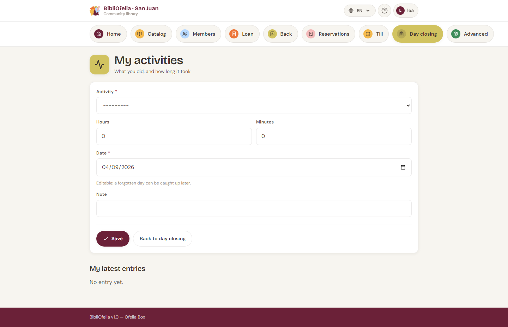
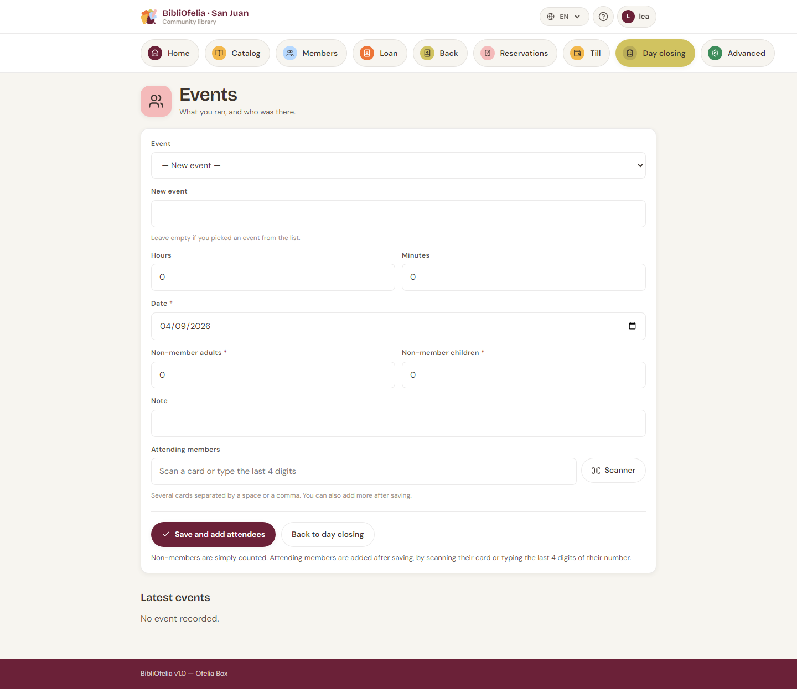
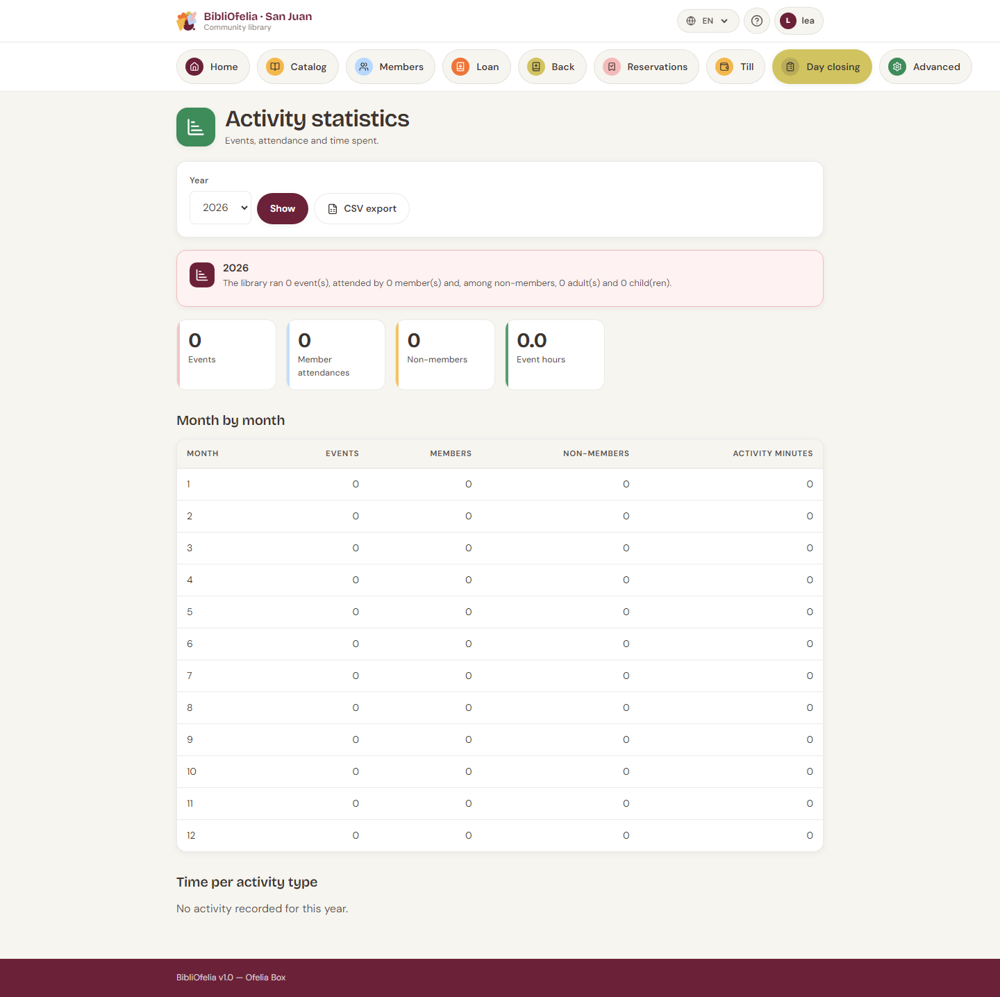

# Activities and events

At year end a funder often asks: *how many events, how many
participants, how many hours of work?* These screens exist so you can
answer.

Two distinct entries:

- **Activity** — an employee's work time (desk, cataloguing,
  shelving…). No audience.
- **Event** — a session with an audience (story time, workshop…).
  Attendees are counted.

## Log an activity

[**Activities**](/bibliofelia/en/closing/activities/){ target="_blank" }
(also from step 1 of [end-of-day closing](bouclement.md)).

1. Kind (desk, cataloguing… — an administrable list).
2. Duration in **hours and minutes** (not a decimal).
3. Date: today by default, editable **into the past** only — you
   cannot log tomorrow's work.
4. Optional note.

A deactivated kind leaves the form but stays in the statistics:
history is not rewritten.

## Log an event

[**Events**](/bibliofelia/en/closing/animations/){ target="_blank" }.

1. Type — you can **create a new one** from the form (« Story time »,
   « Comics workshop »…). Two labels that differ only by case do not
   create a duplicate.
2. Duration, date (today or earlier), presenter, note.
3. **Attendance** from creation:
   - scan cards, or type the **last 4 digits** of the number
     (several codes separated by a space or a comma);
   - count **non-members** separately (adults / children).

If four digits match several cards, the screen **asks you to choose**
instead of guessing. An unknown code does not fail the save: it is
named in a warning, to be fixed on the event page.

On an event's detail you can still add attendees one by one (scan or
typing).

!!! tip "Non-members are not profiles"
    They are counted only. If someone comes often, [enroll them](../usagers/inscription.md).

## Statistics

[**Statistics**](/bibliofelia/en/closing/stats/){ target="_blank" }
(Advanced, or from the lists). Year totals, month by month, time by
kind, members and non-members. A **CSV** is available for the annual
report.

## See also

- [End-of-day closing](bouclement.md)
