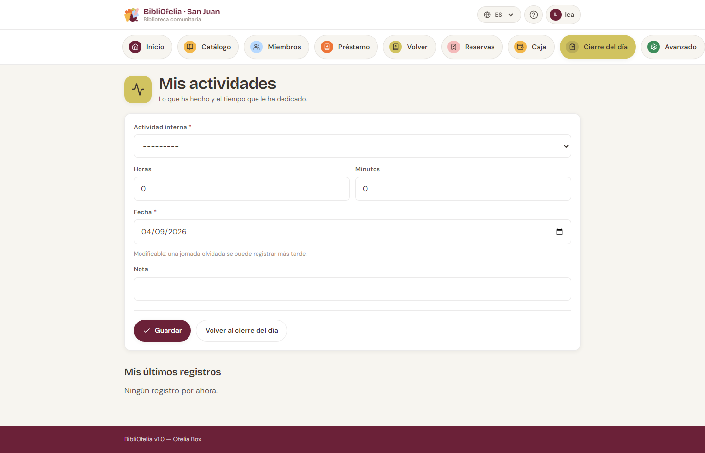
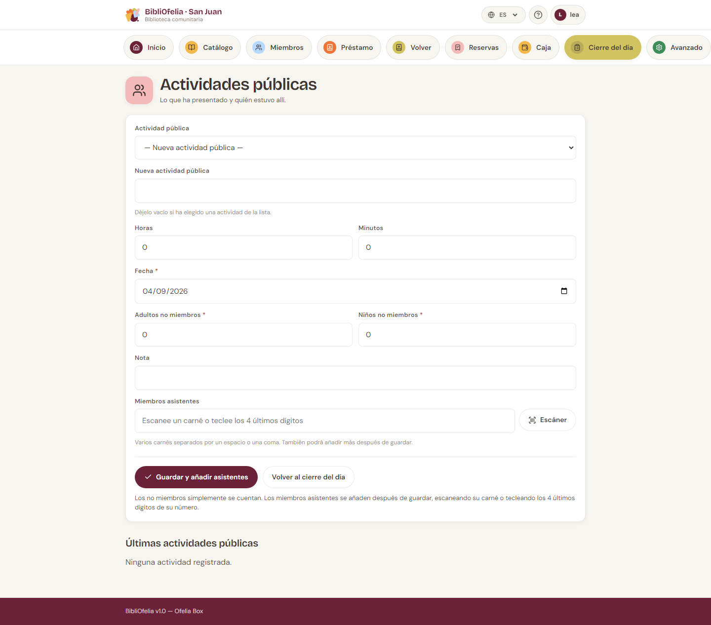
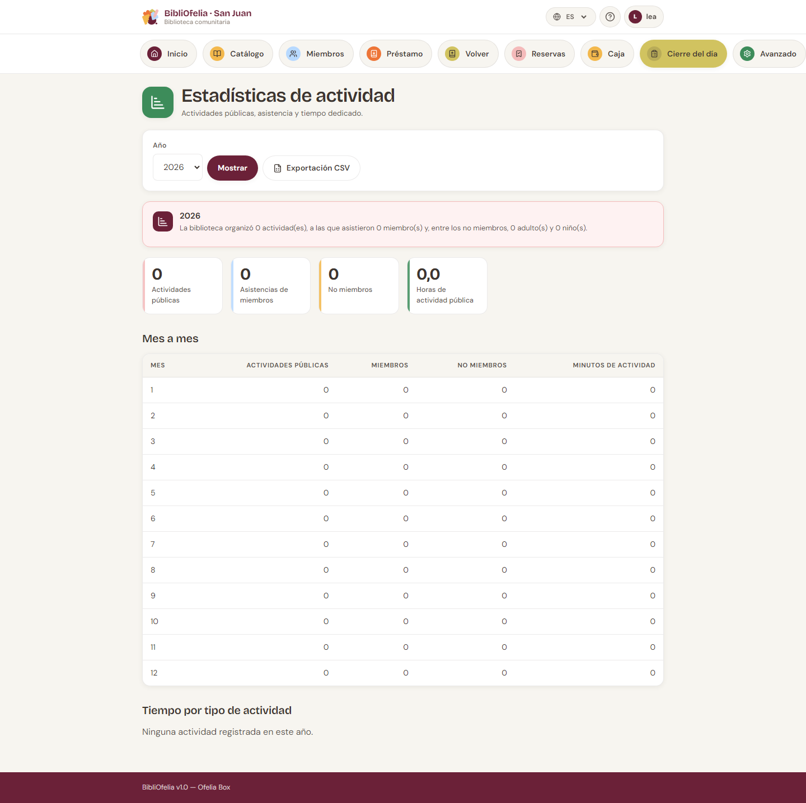

# Actividades y animaciones

A fin de año un financiador suele preguntar: *¿cuántas animaciones,
cuántos participantes, cuántas horas de trabajo?* Estas pantallas
sirven para poder responder.

Dos registros distintos:

- **Actividad** — el tiempo de trabajo de un empleado (mostrador,
  catalogación, orden…). Sin público.
- **Animación** — una sesión con público (hora del cuento, taller…).
  Se cuentan los presentes.

## Registrar una actividad

[**Actividades**](/bibliofelia/es/closing/activities/){ target="_blank" }
(también desde el paso 1 del [cierre](bouclement.md)).

1. Naturaleza (mostrador, catalogación… — lista administrable).
2. Duración en **horas y minutos** (no en decimal).
3. Fecha: hoy por defecto, editable **hacia el pasado** solamente —
   no se registra el trabajo de mañana.
4. Nota facultativa.

Una naturaleza desactivada sale del formulario pero permanece en las
estadísticas: no se reescribe la historia.

## Registrar una animación

[**Animaciones**](/bibliofelia/es/closing/animations/){ target="_blank" }.

1. Tipo — puede **crear uno nuevo** desde el formulario (« Hora del
   cuento », « Taller de cómic »…). Dos etiquetas iguales salvo la
   mayúscula no crean un duplicado.
2. Duración, fecha (hoy o antes), animador, nota.
3. **Asistencias** desde la creación:
   - escanee las tarjetas, o escriba los **4 últimos dígitos** del
     número (varios códigos separados por espacio o coma);
   - cuente aparte a los **no miembros** (adultos / niños).

Si cuatro dígitos coinciden con varias tarjetas, la pantalla **pide
elegir** en vez de adivinar. Un código desconocido no impide guardar:
aparece en un aviso, para retomarlo en la ficha de la animación.

En el detalle de una animación puede seguir añadiendo presentes uno a
uno (escaneo o teclado).

!!! tip "Los no miembros no son fichas"
    Solo se cuentan. Si alguien vuelve a menudo,
    [inscríbalo](../usagers/inscription.md).

## Estadísticas

[**Estadísticas**](/bibliofelia/es/closing/stats/){ target="_blank" }
(Avanzado, o desde las listas). Totales del año, mes a mes, tiempo
por naturaleza, miembros y no miembros. Un **CSV** está disponible
para el informe anual.

## Véase también

- [Cierre del día](bouclement.md)
