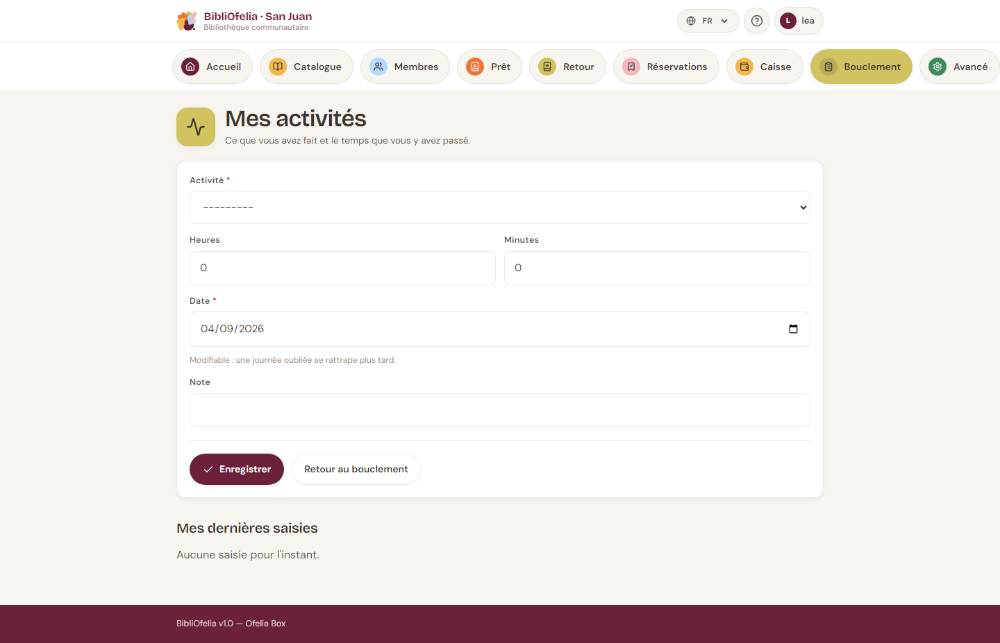
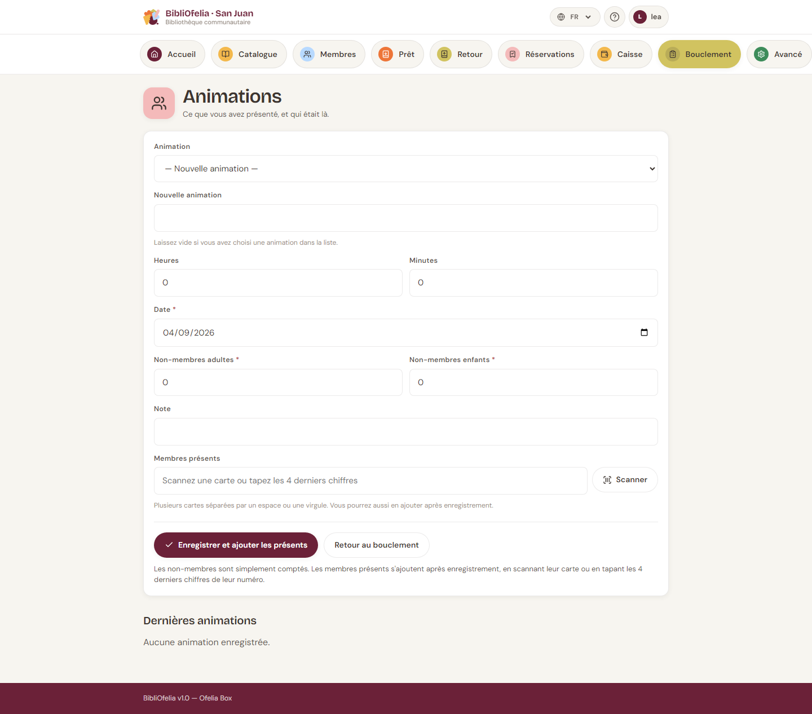
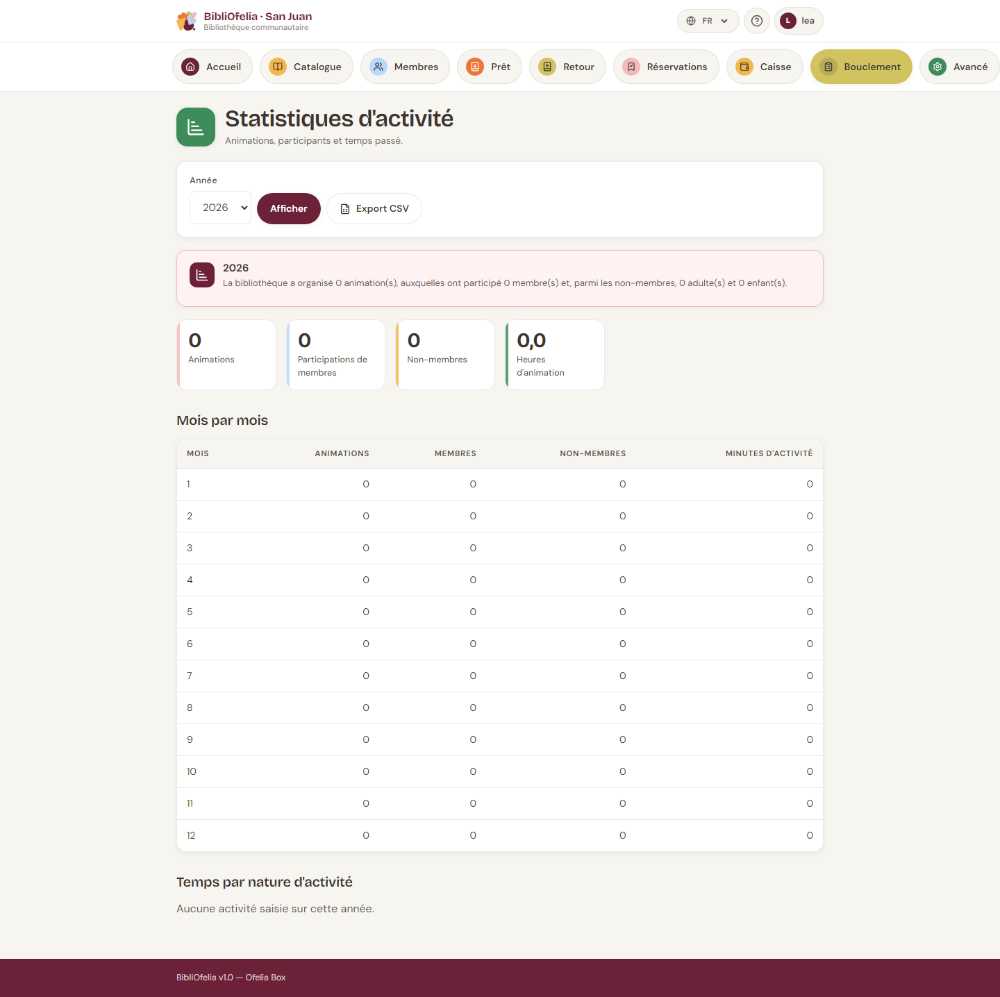

# Activités et animations

En fin d'année, un bailleur demande souvent : *combien d'animations,
combien de participants, combien d'heures de travail ?* Ces écrans
servent à pouvoir répondre.

Deux saisies distinctes :

- **Activité** — le temps de travail d'un employé (accueil, catalogage,
  rangement…). Pas de public.
- **Animation** — une séance avec du public (heure du conte, atelier…).
  On y compte les présents.

## Saisir une activité

[**Activités**](/bibliofelia/fr/closing/activities/){ target="_blank" }
(aussi depuis l'étape 1 du [bouclement](bouclement.md)).

1. Nature (accueil, catalogage… — liste administrable).
2. Durée en **heures et minutes** (pas en décimal).
3. Date : aujourd'hui par défaut, modifiable **vers le passé**
   seulement — on ne saisit pas le travail de demain.
4. Note facultative.

Une nature désactivée disparaît du formulaire mais reste dans les
statistiques : on ne réécrit pas l'histoire.

## Saisir une animation

[**Animations**](/bibliofelia/fr/closing/animations/){ target="_blank" }.

1. Type — vous pouvez en **créer un nouveau** depuis le formulaire
   (« Heure du conte », « Atelier BD »…). Deux libellés identiques,
   casse mise à part, ne créent pas un doublon.
2. Durée, date (aujourd'hui ou plus tôt), animateur, note.
3. **Présences** dès la création :
   - scannez les cartes, ou tapez les **4 derniers chiffres** du
     numéro (plusieurs codes séparés par un espace ou une virgule) ;
   - comptez à part les **non-membres** (adultes / enfants).

Si quatre chiffres correspondent à plusieurs cartes, l'écran **demande
de choisir** au lieu de deviner. Un code inconnu n'empêche pas
l'enregistrement : il est nommé dans un avertissement, à reprendre sur
la fiche de l'animation.

Sur le détail d'une animation, vous ajoutez encore des présents un par
un (scan ou saisie).

!!! tip "Les non-membres ne sont pas des fiches"
    On les compte seulement. Si quelqu'un revient souvent, inscrivez-le
    comme [membre](../usagers/inscription.md).

## Statistiques

[**Statistiques**](/bibliofelia/fr/closing/stats/){ target="_blank" }
(Avancé, ou depuis les listes). Totaux de l'année, mois par mois,
temps par nature, nombre de membres et de non-membres. Un **CSV**
est disponible pour le rapport annuel.

## Voir aussi

- [Bouclement de la journée](bouclement.md)
