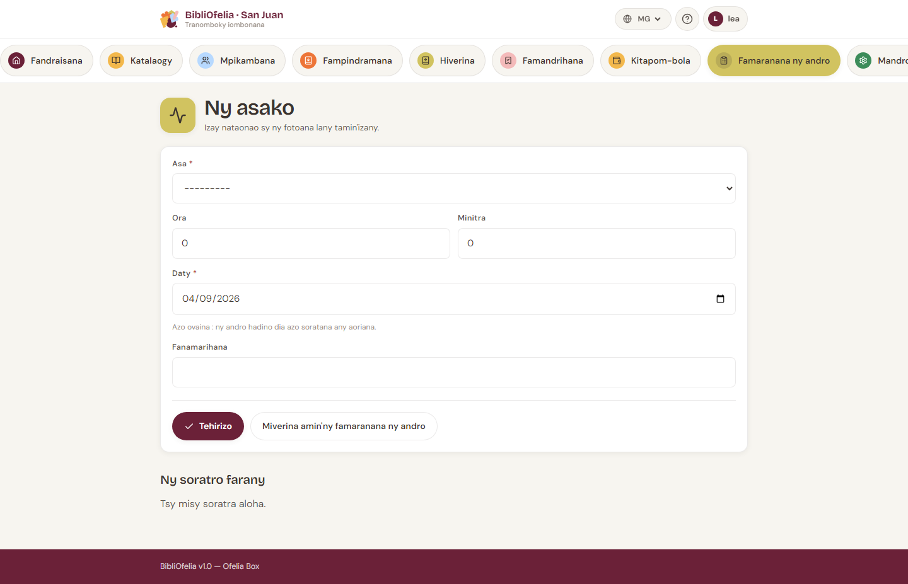
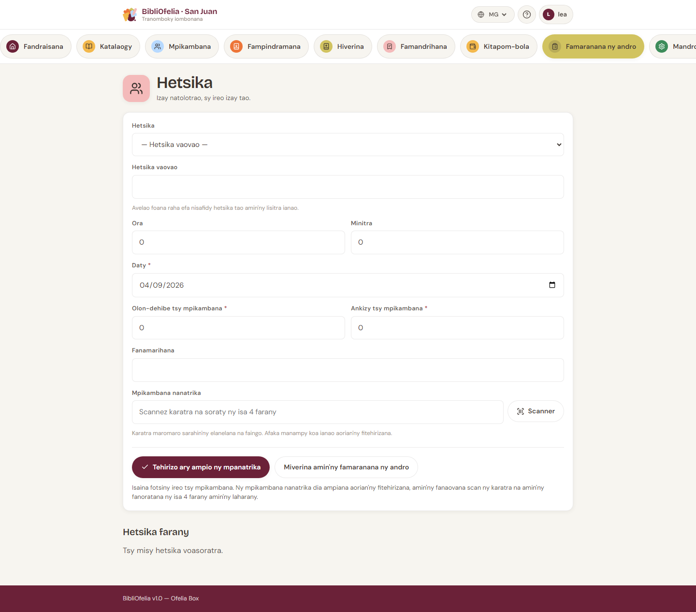
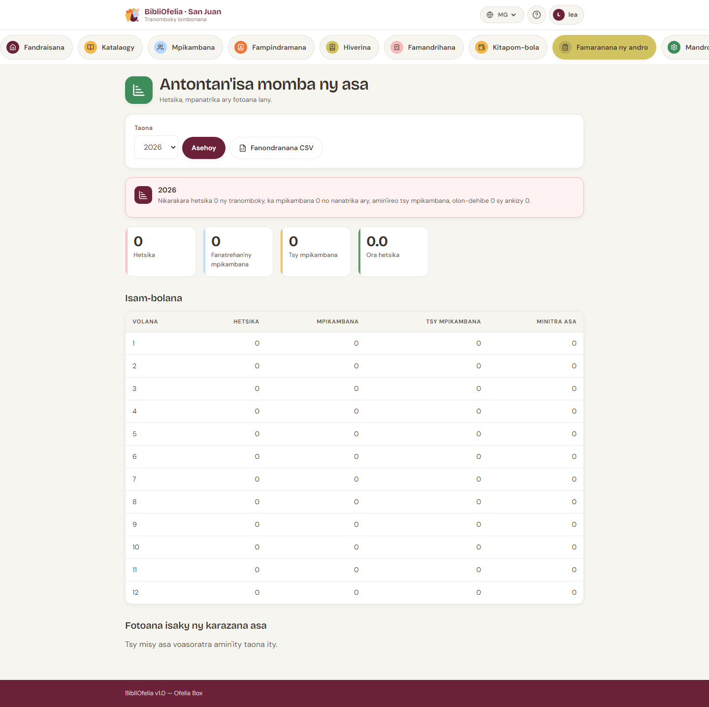

# Asa sy animation

Amin'ny faran'ny taona dia manontany ny mpanohana: *animation firy,
olona firy, ora firy?* Ireo pejy ireo no ahafahana mamaly.

Fisoratana roa samy hafa:

- **Asa (activité)** — fotoana fiasan'ny mpiasa (fandraisana,
  catalogue, fandrindrana…). Tsy misy mpihaino.
- **Animation** — fivoriana miaraka amin'ny olona (ora tantara,
  atelier…). Isaina ny tonga.

## Soraty ny asa

[**Activités**](/bibliofelia/mg/closing/activities/){ target="_blank" }
(avy amin'ny dingana 1 amin'ny [famaranana](bouclement.md) koa).

1. Karazana (fandraisana, catalogue… — lisitra azo tantanina).
2. Faharetana amin'ny **ora sy minitra** (tsy desimaly).
3. Daty: androany raha tsy voafaritra, azo ovaina **mandroso ny lasa**
   ihany — tsy soratana ny asan'ny ampitso.
4. Fanamarihana tsy voatery.

Ny karazana voajanahary dia miala amin'ny formulaire fa mijanona ao
amin'ny statistika.

## Soraty ny animation

[**Animations**](/bibliofelia/mg/closing/animations/){ target="_blank" }.

1. Karazana — azonao **foronina vaovao** avy amin'ny formulaire.
   Anarana mitovy afa-tsy ny litera lehibe dia tsy miteraka doublon.
2. Faharetana, daty (androany na aloha), mpitarika, fanamarihana.
3. **Tonga** hatrany amin'ny famoronana:
   - scan-o ny karatra, na soraty ny **isa 4 farany** amin'ny laharana
     (kaody maromaro voasaraka tsipika na virgule);
   - isaina manokana ny **tsy mpianatra** (olon-dehibe / ankizy).

Raha mifanandrify karatra maromaro ny isa 4, ny pejy **manontany
hifidy** fa tsy mihevitra. Ny kaody tsy fantatra dia tsy manakana ny
fitehirizana: voalaza ao amin'ny fampandrenesana.

Ao amin'ny antsipirian'ny animation dia mbola azonao ampiana ny tonga
iray-iray.

!!! tip "Ny tsy mpianatra dia tsy takelaka"
    Isaina fotsiny izy ireo. Raha tonga matetika, [soraty ho
    mpianatra](../usagers/inscription.md).

## Statistika

[**Statistika**](/bibliofelia/mg/closing/stats/){ target="_blank" }.
Tontalin'ny taona, volana isaky ny volana, fotoana isaky ny karazana,
mpianatra sy tsy mpianatra. Misy **CSV** ho an'ny tatitra isan-taona.

## Jereo koa

- [Famaranana ny andro](bouclement.md)
