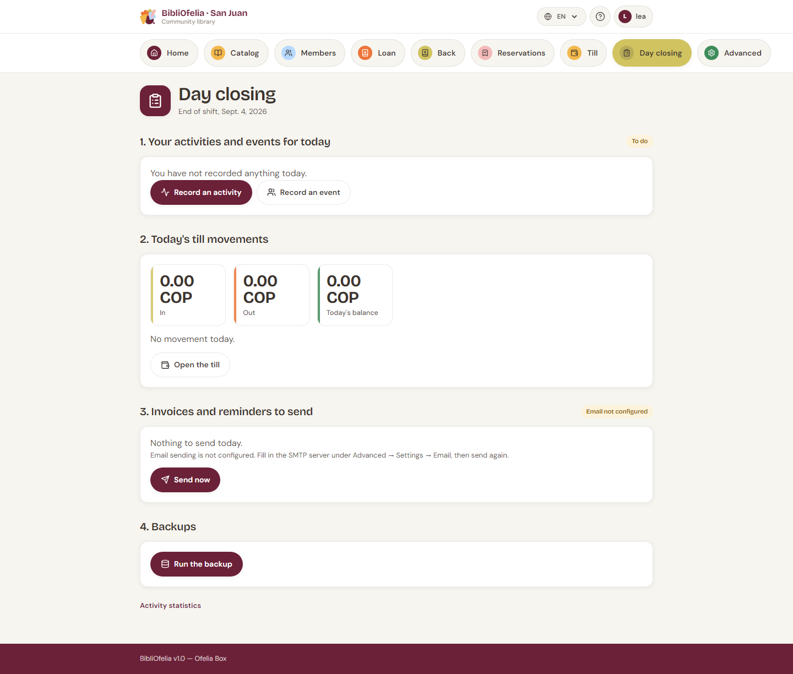

# End-of-day closing

The [**Closing**](/bibliofelia/en/closing/){ target="_blank" } tile
walks through the end of service, in order. It is **not a lock**: one
staff member can close at noon, another in the evening.

Five steps:

## 1. Your activities and events today

What **you** already logged today, with a **Logged** or **To do**
badge. Buttons to
[Log an activity](activites.md) and
[Log an event](activites.md).

## 2. Today's cash movements

In, out, today's balance, and the detail. Link to
[Open the cash desk](caisse.md) if a movement is missing.

## 3. Invoices and reminders to send

Invoices never sent, and reminders for invoices overdue by more than
one day (one reminder per invoice).

The button depends on where you are:

- **Hosted instance** (Grand-Saconnex, Sanjuan): **Send now**. If
  SMTP is not configured, the screen says so (Advanced → Settings →
  Email) instead of talking about the Box.
- **Ofelia Box online**: **Send now**.
- **Ofelia Box offline**: **Queue for later**. Emails go out once
  the Box is back online. Meanwhile, call people **by phone** (the
  list is on screen).

## 4. Backups

**Run backup**. A **Done** or **Failed** badge stays on screen. If it
fails, tell the administrator.

## 5. Shut down the Box

This step **appears only on the Ofelia Box**, and only for an
administrator. On a hosted instance it would make no sense.

BibliOfelia cannot shut the Box down itself (it runs in a container):
it drops a request that the Box's system service must watch. If that
service is not installed yet, the request is recorded **but the Box
does not shut down** — the screen says so.

To shut down by hand: the Box power button, or ask the administrator.

!!! tip "Suggested order"
    Activities → a look at the till → sends → backup → shutdown.
    Nothing stops you from skipping a step and coming back.
