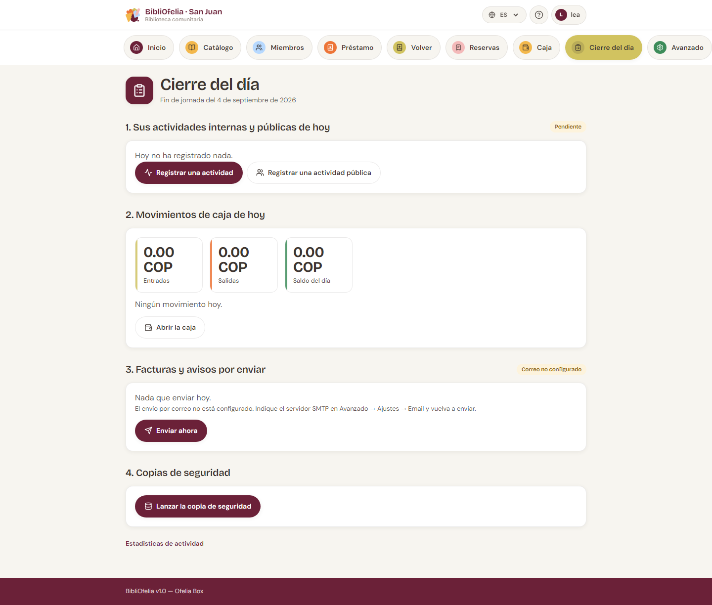

# Cierre del día

La tarjeta [**Cierre**](/bibliofelia/es/closing/){ target="_blank" }
recorre el final de servicio, en orden. **No es un candado**: un
empleado puede cerrar al mediodía, otro por la tarde.

Cinco pasos:

## 1. Sus actividades y animaciones del día

Lo que **usted** ya registró hoy, con una insignia **Registrado** o
**Por hacer**. Botones hacia
[Registrar una actividad](activites.md) y
[Registrar una animación](activites.md).

## 2. Movimientos de caja del día

Entradas, salidas, saldo del día, y el detalle. Enlace a
[Abrir la caja](caisse.md) si falta un movimiento.

## 3. Facturas y recordatorios a enviar

Facturas nunca enviadas, y recordatorios de facturas vencidas desde
hace más de un día (un solo recordatorio por factura).

El botón cambia según el lugar:

- **Instancia alojada** (Grand-Saconnex, Sanjuan): **Enviar ahora**.
  Si el SMTP no está configurado, la pantalla lo dice (Avanzado →
  Ajustes → Email) en vez de hablar de la Box.
- **Ofelia Box en línea**: **Enviar ahora**.
- **Ofelia Box sin conexión**: **Poner en cola**. Los correos salen
  cuando la Box vuelva a estar en línea. Mientras tanto, avise a las
  personas **por teléfono** (la lista está a la vista).

## 4. Copias de seguridad

**Lanzar la copia**. Una insignia **Hecha** o **Fallo** permanece.
Si falla, avise al administrador.

## 5. Apagar la Box

Este paso **solo aparece en la Ofelia Box**, y solo para un
administrador. En una instancia alojada no tiene sentido.

BibliOfelia no puede apagar la Box ella misma (corre en un
contenedor): deja una petición que el servicio del sistema de la Box
debe vigilar. Si ese servicio aún no está instalado, la petición se
registra **pero la Box no se apaga** — la pantalla lo dice.

Para apagar a mano: el botón de encendido de la Box, o pídaselo al
administrador.

!!! tip "Orden aconsejado"
    Actividades → un vistazo a la caja → envíos → copia → apagado.
    Nada impide saltar un paso y volver.
