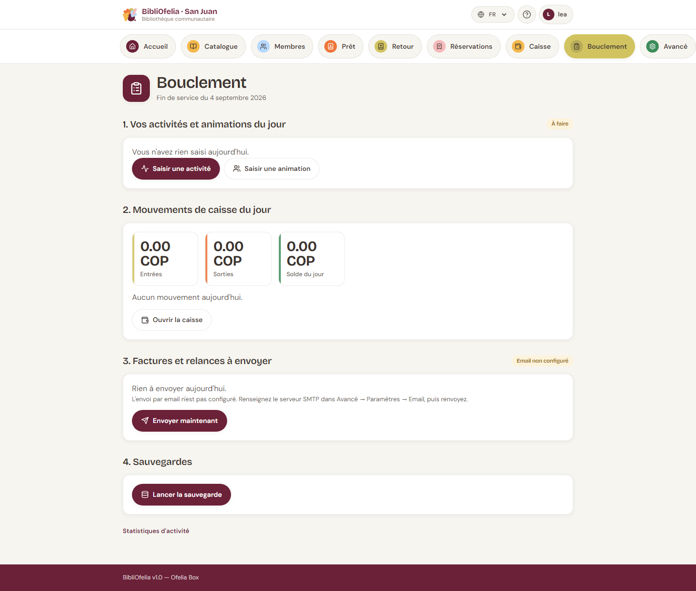

# Bouclement de la journée

La tuile [**Bouclement**](/bibliofelia/fr/closing/){ target="_blank" }
déroule la fin de service, dans l'ordre. Ce n'est **pas un verrou** :
un employé peut boucler à midi, un autre le soir.

Cinq étapes :

## 1. Vos activités et animations du jour

Ce que **vous** avez déjà saisi aujourd'hui, avec un badge **Saisi**
ou **À faire**. Boutons vers
[Saisir une activité](activites.md) et
[Saisir une animation](activites.md).

## 2. Mouvements de caisse du jour

Entrées, sorties, solde du jour, et le détail. Lien vers
[Ouvrir la caisse](caisse.md) si un mouvement manque.

## 3. Factures et relances à envoyer

Factures jamais envoyées, et relances des factures échues depuis plus
d'un jour (une seule relance par facture).

Le bouton change selon le lieu :

- **Instance hébergée** (Grand-Saconnex, Sanjuan) : **Envoyer
  maintenant**. Si le SMTP n'est pas configuré, l'écran le dit
  (Avancé → Paramètres → Email) au lieu de parler de la Box.
- **Ofelia Box en ligne** : **Envoyer maintenant**.
- **Ofelia Box hors ligne** : **Mettre en file d'attente**. Les
  emails partent dès que la Box est de nouveau en ligne. En
  attendant, prévenez les personnes **par téléphone** (la liste
  est sous vos yeux).

## 4. Sauvegardes

**Lancer la sauvegarde**. Un badge **Faite** ou **Échec** reste
affiché. Si ça échoue, prévenez l'administrateur.

## 5. Éteindre la Box

Cette étape **n'apparaît que sur la Ofelia Box**, et seulement pour
un administrateur. Sur une instance hébergée, elle n'a aucun sens.

BibliOfelia ne peut pas éteindre la Box elle-même (elle tourne dans
un conteneur) : elle dépose une demande que le système de la Box
doit surveiller. Si ce service n'est pas encore installé, la demande
est enregistrée **mais la Box ne s'éteint pas** — l'écran le dit.

Pour éteindre à la main : bouton d'alimentation de la Box, ou
demandez à l'administrateur.

!!! tip "Ordre conseillé"
    Activités → coup d'œil à la caisse → envois → sauvegarde →
    extinction. Rien n'empêche de sauter une étape et d'y revenir.
