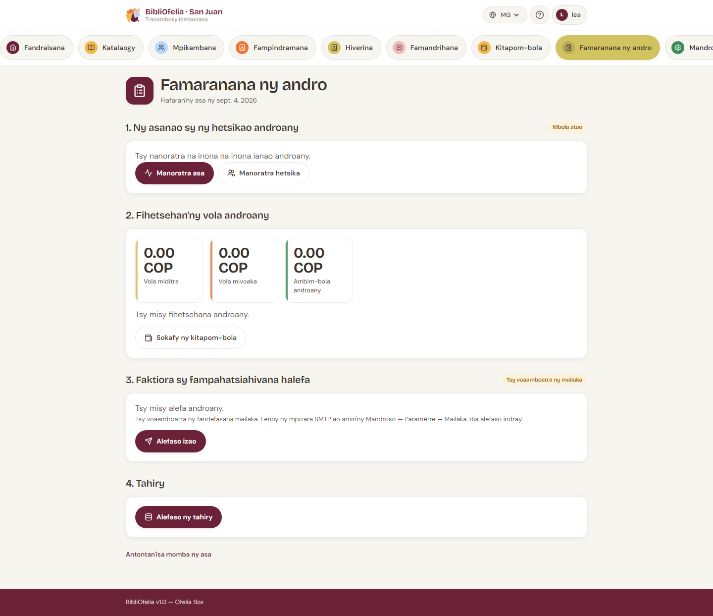

# Famaranana ny andro

Ny tabilao [**Bouclement**](/bibliofelia/mg/closing/){ target="_blank" }
dia manaraka ny faran'ny tolotra, araka ny filaharana. **Tsy hidy**
izany: ny mpiasa iray dia afaka manidy antoandro, ny iray hafa hariva.

Dingana dimy:

## 1. Ny asanao sy animation anio

Izay efa nosoratanao anio, miaraka amin'ny badge **Voasoratra** na
**Tokony hatao**. Bokotra mankany
[Soraty ny asa](activites.md) sy
[Soraty ny animation](activites.md).

## 2. Hetsika caisse anio

Fidirana, fivoahana, saldo anio, sy ny antsipiriany. Rohy mankany
[Sokafy ny caisse](caisse.md) raha tsy ampy ny hetsika.

## 3. Faktiora sy fampahatsiahivana alefa

Faktiora tsy mbola nalefa, sy fampahatsiahivana ny faktiora efa
nihoatra ny iray andro (fampahatsiahivana iray isaky ny faktiora).

Ny bokotra dia miova araka ny toerana:

- **Instance voarindra** (Grand-Saconnex, Sanjuan): **Alefaso izao**.
  Raha tsy voamboatra ny SMTP, ny pejy milaza izany (Avancé →
  Paramètres → Email) fa tsy miresaka ny Box.
- **Ofelia Box an-tserasera**: **Alefaso izao**.
- **Ofelia Box tsy an-tserasera**: **Apetraho ao anaty filaharana**.
  Ny mailaka dia lasa rehefa an-tserasera indray ny Box. Ampandrenesina
  **an-telefaonina** (ny lisitra dia eo imasonao).

## 4. Backup

**Alefaso ny backup**. Badge **Vita** na **Tsy nahomby**. Raha tsy
nahomby, lazao ny mpitantana.

## 5. Vonoy ny Box

Ity dingana ity **hita amin'ny Ofelia Box ihany**, ary ho an'ny
mpitantana ihany. Amin'ny instance voarindra dia tsy misy dikany.

Tsy afaka mamono ny Box ny BibliOfelia (ao anaty container izy):
mametraka fangatahana izay tokony hojerena ny service système. Raha
tsy mbola voapetraka io service io, voarakitra ny fangatahana **fa
tsy vonoina ny Box** — ny pejy milaza izany.

Hamono tanana: bokotra herinaratra ny Box, na anontanio ny
mpitantana.

!!! tip "Filaharana tsara"
    Asa → jereo ny caisse → fandefasana → backup → famonoana. Afaka
    mitsambikina dingana ianao ary miverina.
