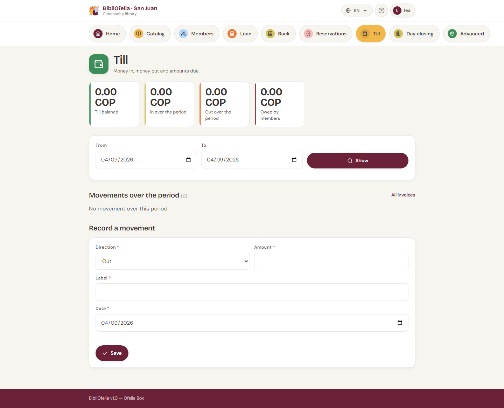

# Cash desk and invoices

The [**Cash desk**](/bibliofelia/en/finance/){ target="_blank" } tracks
money in and out: membership fees, fines, event fees, and till
expenses.

Open it from the **Cash desk** tile on the dashboard, or from the
section bar at the top of every page.

## What you see

Four counters:

- **Cash balance** — what should be in the till
- **In** and **Out** for the displayed period (today by default)
- **Owed by members** — total of still-open invoices

Change **From** / **To**, then **Show**.

Below: the list of movements, and a link to
[**All invoices**](/bibliofelia/en/finance/invoices/){ target="_blank" }.

## Taking a payment

The shortest path starts from the [member profile](../usagers/fiche.md):

1. The **Account** box says whether they are up to date, have an
   amount due, or are overdue.
2. Click **Account and invoices**, then open the invoice.
3. Click **Take payment**. The amount is pre-filled with the balance.
4. Choose the method: **cash** (default) or bank transfer.
5. Confirm.

A **cash** payment creates a till entry — that is what keeps the
drawer in line. A **transfer does not enter the till**, otherwise a
physical count would never match.

Partial payments are accepted. An amount above the balance is
refused.

## Membership, fine, event fee

- **Membership fee** — billed automatically at enrollment and at each
  [card renewal](../usagers/renouvellement.md). The amount comes from
  the [category](tarifs.md). A fee of 0 emits nothing.
- **Fine** — **manual only**, from the profile (**Fine**). You pick
  the reason and the amount. BibliOfelia never auto-calculates an
  overdue fine.
- **Event fee** — same path, **Event fee** button.

Changing a member's category **realigns** still-open, unpaid
membership invoices. A fee already paid is not refunded.

## Invoice PDF and email

From an invoice: **PDF** opens an A4 sheet in OFELIA branding. **Send
by email** queues the message, even when the Box is online — a failed
send then leaves a trace.

A numbered invoice is **never deleted**: it is **cancelled**. An
invoice already paid cannot be cancelled.

## Email queue

If messages are waiting, a banner appears at the top of the cash desk.

- **On the Box**, offline: emails stay in the queue. Call people
  **by phone**, or resend when the Box is back online.
- **On a hosted instance** (Grand-Saconnex, Sanjuan): **Send now**
  goes out immediately. If the screen says email is not configured,
  fill in SMTP under **Advanced → Settings → Email**.

Only an administrator can flush the queue.

## Manual movement

For an expense (supplies, change) or income that is not a member
payment: **New movement**. Set the direction (in / out), amount and
label.

## Currency

The instance currency is set under **Advanced → Settings → Cash desk
— currency and due dates**. Type at least two letters (code, currency
name or country name): CHF, bolívar, Switzerland…

!!! tip "At the end of the day"
    [End-of-day closing](bouclement.md) walks through today's balance,
    invoices to send and the backup, in order.
