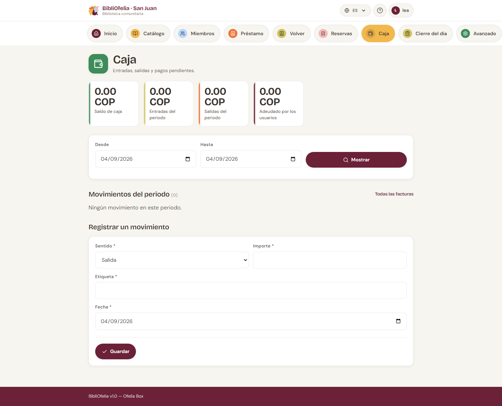

# Caja y facturas

La [**Caja**](/bibliofelia/es/finance/){ target="_blank" } sigue el
dinero que entra y sale: cuotas, multas, gastos de animación y los
gastos del cajón.

Se abre desde la tarjeta **Caja** del panel, o desde la barra de
secciones arriba de cada página.

## Lo que ve

Cuatro contadores:

- **Saldo de caja** — lo que debería haber en el cajón
- **Entradas** y **Salidas** del periodo mostrado (el día por
  defecto)
- **Adeudado por los usuarios** — total de facturas aún abiertas

Puede cambiar **Del** / **Al** y luego **Mostrar**.

Más abajo: la lista de movimientos, y un enlace a
[**Todas las facturas**](/bibliofelia/es/finance/invoices/){ target="_blank" }.

## Cobrar a un usuario

El camino más corto parte de su [ficha](../usagers/fiche.md):

1. El recuadro **Cuenta** dice si está al día, si tiene un importe a
   pagar, o si está atrasado.
2. Pulse **Cuenta y facturas**, luego abra la factura.
3. Pulse **Cobrar**. El importe se rellena con el saldo.
4. Elija el modo: **efectivo** (por defecto) o transferencia.
5. Confirme.

Un pago en **efectivo** crea una entrada de caja — es lo que hace
cuadrar el cajón. Una **transferencia no entra en la caja**, si no el
recuento físico nunca coincidiría.

Se aceptan pagos parciales. Un importe superior al saldo se rechaza.

## Cuota, multa, animación

- **Cuota** — se factura sola al inscribir y en cada
  [renovación de tarjeta](../usagers/renouvellement.md). El importe
  depende de la [categoría](tarifs.md). Un 0 no emite nada.
- **Multa** — **solo a mano**, desde la ficha (**Multa**). Usted
  elige el motivo y el importe. BibliOfelia nunca calcula sola una
  multa por atraso.
- **Gastos de animación** — el mismo camino, botón **Gastos de
  animación**.

Cambiar la categoría de un usuario **realinea** las cuotas aún
abiertas (sin pago). Una cuota ya cobrada no se reembolsa.

## Factura PDF y correo

Desde una factura: **PDF** abre un A4 con la identidad OFELIA.
**Enviar por correo** deja el mensaje en una cola, incluso si la Box
está en línea — así un envío fallido deja rastro.

Una factura numerada **no se borra**: se **anula**. Una factura ya
cobrada no se puede anular.

## Cola de correos

Si hay mensajes en espera, un aviso aparece arriba de la caja.

- **En la Box**, sin conexión: los correos siguen en cola. Aviso a
  las personas **por teléfono**, o reenvíe cuando la Box vuelva a
  estar en línea.
- **En una instancia alojada** (Grand-Saconnex, Sanjuan): **Enviar
  ahora** sale enseguida. Si la pantalla dice que el correo no está
  configurado, rellene el SMTP en **Avanzado → Ajustes → Email**.

Solo un administrador puede vaciar la cola.

## Movimiento manual

Para un gasto (material, cambio) o un ingreso que no es un pago de
usuario: **Nuevo movimiento**. Indique el sentido (entrada / salida),
el importe y el concepto.

## Divisa

La divisa de la instancia se regula en **Avanzado → Ajustes → Caja —
divisa y vencimientos**. Escriba al menos dos letras (código, nombre
de divisa o de país): CHF, bolívar, Suiza…

!!! tip "Al final del día"
    El [cierre](bouclement.md) retoma el saldo del día, las facturas
    a enviar y la copia de seguridad, en ese orden.
