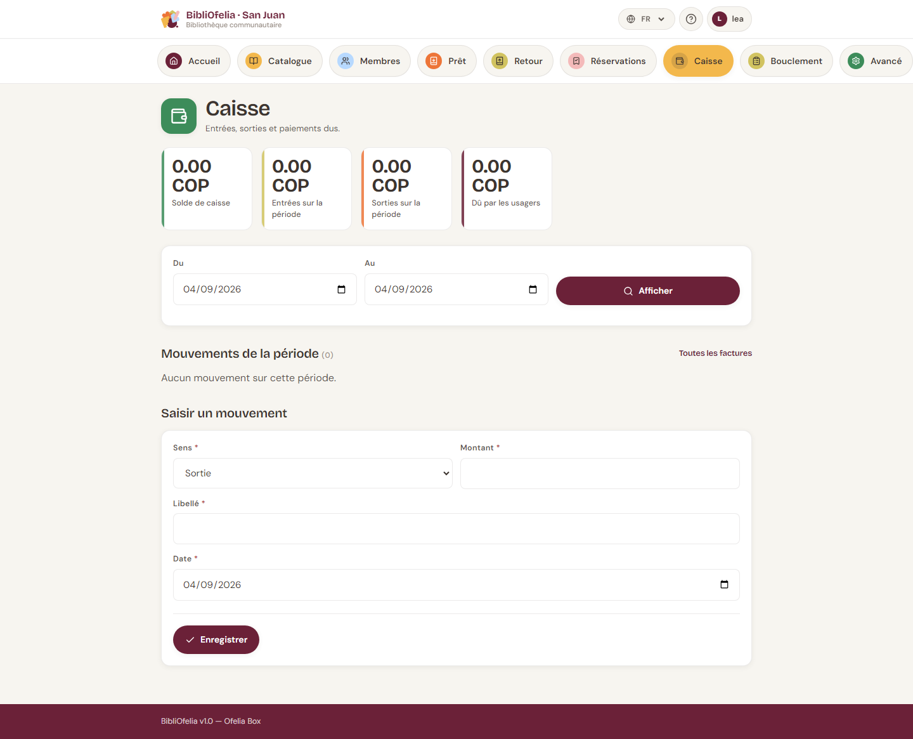

# Caisse et factures

La [**Caisse**](/bibliofelia/fr/finance/){ target="_blank" } suit l'argent
qui entre et qui sort : cotisations, amendes, frais d'animation, et
les dépenses du tiroir.

Vous y accédez depuis la tuile **Caisse** du tableau de bord, ou depuis
la barre de sections en haut de chaque page.

## Ce que vous voyez

Quatre compteurs :

- **Solde de caisse** — ce qui devrait être dans le tiroir
- **Entrées** et **Sorties** sur la période affichée (la journée par
  défaut)
- **Dû par les usagers** — total des factures encore ouvertes

Vous pouvez changer les dates **Du** / **Au** puis **Afficher**.

Plus bas : la liste des mouvements, et un lien vers
[**Toutes les factures**](/bibliofelia/fr/finance/invoices/){ target="_blank" }.

## Encaisser un usager

Le plus simple part de sa [fiche](../usagers/fiche.md) :

1. L'encadré **Compte** dit s'il est à jour, s'il a un montant à
   régler, ou s'il est en retard.
2. Cliquez sur **Compte et factures**, puis ouvrez la facture.
3. Cliquez sur **Encaisser**. Le montant est pré-rempli au solde.
4. Choisissez le mode : **espèces** (par défaut) ou virement.
5. Validez.

Un paiement en **espèces** crée une entrée de caisse — c'est ce qui
fait tenir le tiroir. Un **virement n'entre pas dans la caisse**,
sinon le comptage physique ne tomberait jamais juste.

Les paiements partiels sont acceptés. Un montant supérieur au solde
est refusé.

## Cotisation, amende, animation

- **Cotisation** — facturée toute seule à l'inscription et à chaque
  [renouvellement de carte](../usagers/renouvellement.md). Le montant
  dépend de la [catégorie](tarifs.md). Un montant à 0 n'émet rien.
- **Amende** — uniquement **à la main**, depuis la fiche
  (**Amende**). Vous choisissez le motif et le montant. BibliOfelia
  ne calcule jamais une amende de retard tout seul.
- **Frais d'animation** — même chemin, bouton **Frais d'animation**.

Changer la catégorie d'un usager **réaligne** les cotisations encore
ouvertes (sans paiement). Une cotisation déjà réglée n'est pas
remboursée.

## Facture PDF et email

Depuis une facture : **PDF** ouvre un A4 à la charte OFELIA (à
imprimer ou à envoyer). **Envoyer par email** dépose le message dans
une file d'attente, même si la Box est en ligne — ainsi un envoi
raté laisse une trace.

Une facture numérotée **ne se supprime pas** : elle s'**annule**.
Une facture déjà encaissée ne peut plus être annulée.

## File d'emails

Si des messages attendent, un bandeau s'affiche en haut de la caisse.

- **Sur la Box**, hors ligne : les emails restent en file. Prévenez
  les personnes **par téléphone**, ou renvoyez quand la Box est de
  nouveau en ligne.
- **Sur une instance hébergée** (Grand-Saconnex, Sanjuan) : le bouton
  **Envoyer maintenant** part tout de suite. Si l'écran dit que
  l'email n'est pas configuré, renseignez le SMTP dans
  **Avancé → Paramètres → Email**.

Seul un administrateur peut vider la file.

## Mouvement manuel

Pour une dépense (fournitures, monnaie) ou une rentrée qui n'est pas
un paiement d'usager : **Nouveau mouvement**. Indiquez le sens
(entrée / sortie), le montant et le libellé.

## Devise

La devise de l'instance se règle dans **Avancé → Paramètres → Caisse
— devise et échéances**. Tapez au moins deux lettres (code, nom de
devise ou nom de pays) : CHF, bolívar, Suisse…

!!! tip "En fin de journée"
    Le [bouclement](bouclement.md) reprend le solde du jour, les
    factures à envoyer et la sauvegarde, dans l'ordre.
