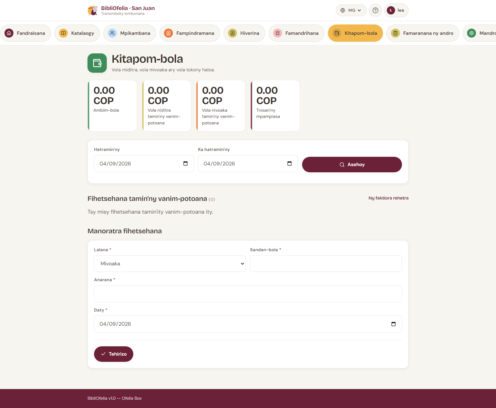

# Caisse sy faktiora

Ny [**Caisse**](/bibliofelia/mg/finance/){ target="_blank" } dia
manara-maso ny vola miditra sy mivoaka: saram-pianarana, sazy, saran'ny
animation, ary ny fandaniana amin'ny drawer.

Sokafy avy amin'ny tabilao **Caisse** na avy amin'ny bara fizarana
any ambony.

## Izay hita

Isa efatra:

- **Saldon'ny caisse** — izay tokony ho ao anaty drawer
- **Fidirana** sy **Fivoahana** amin'ny vanim-potoana (androany raha
  tsy voafaritra)
- **Trosa amin'ny mpianatra** — tontalin'ny faktiora mbola misokatra

Ovay ny daty **Nanomboka** / **Hatramin'ny** dia **Asehoy**.

Ambany: lisitry ny hetsika, sy rohy mankany
[**Faktiora rehetra**](/bibliofelia/mg/finance/invoices/){ target="_blank" }.

## Mandray vola amin'ny mpianatra

Ny lalana fohy indrindra dia avy amin'ny
[takelaka](../usagers/fiche.md):

1. Ny boaty **Kaonty** milaza raha tsy trosa izy, raha misy vola
   aloha, na raha tara.
2. Tsindrio **Kaonty sy faktiora**, dia sokafy ny faktiora.
3. Tsindrio **Raiso ny vola**. Ny vola dia efa feno amin'ny trosa.
4. Safidio ny fomba: **vola an-tanana** (tsotra) na virement.
5. Hamafiso.

Ny fandoavana **an-tanana** dia manao fidirana caisse — izany no
mahatonga ny drawer hifanaraka. Ny **virement tsy miditra ao amin'ny
caisse**, raha tsy izany dia tsy mifanaraka mihitsy ny isan'ny vola.

Ekena ny fandoavana ampahany. Ny vola mihoatra ny trosa dia tsy
ekena.

## Saram-pianarana, sazy, animation

- **Saram-pianarana** — faktiorina ho azy amin'ny fisoratana sy
  amin'ny [fanavaozana karatra](../usagers/renouvellement.md). Ny
  vola dia avy amin'ny [sokajy](tarifs.md). 0 = tsy misy faktiora.
- **Sazy** — **tanana ihany**, avy amin'ny takelaka (**Sazy**). Ianao
  no mifidy ny antony sy ny vola. Tsy kajy ho azy mihitsy ny sazy
  tara.
- **Saran'ny animation** — lalana mitovy, bokotra **Saran'ny
  animation**.

Ny fanovana sokajy dia **mampifanaraka** ny saram-pianarana mbola
misokatra (tsy naloa). Ny vola efa naloa dia tsy averina.

## Faktiora PDF sy mailaka

Avy amin'ny faktiora: **PDF** manokatra A4 OFELIA. **Alefaso
mailaka** dia mametraka ny hafatra ao anaty filaharana, na dia
an-tserasera aza ny Box — raha tsy lasa dia misy dian-tongotra.

Ny faktiora manana laharana **tsy fafana**: **foanana**. Ny faktiora
efa naloa dia tsy azo foanana.

## Filaharan'ny mailaka

Raha misy hafatra miandry, misy bandeau eo an-tampon'ny caisse.

- **Eo amin'ny Box**, tsy an-tserasera: mijanona ao anaty filaharana
  ny mailaka. Ampandrenesina **an-telefaonina**, na alefaso indray
  rehefa an-tserasera ny Box.
- **Amin'ny instance voarindra** (Grand-Saconnex, Sanjuan):
  **Alefaso izao**. Raha tsy voamboatra ny email, fenoy ny SMTP ao
  amin'ny **Avancé → Paramètres → Email**.

Ny mpitantana ihany no afaka manala ny filaharana.

## Hetsika tanana

Ho an'ny fandaniana na fidirana tsy fandoavan'ny mpianatra:
**Hetsika vaovao**. Lazao ny lalana (fidirana / fivoahana), ny vola
sy ny anarana.

## Vola (devise)

Ny volan'ny instance dia ao amin'ny **Avancé → Paramètres → Caisse —
devise et échéances**. Soraty litera roa farafahakeliny (kaody, anaran'ny
vola na firenena).

!!! tip "Amin'ny faran'ny andro"
    Ny [famaranana](bouclement.md) dia maka ny saldo anio, ny
    faktiora alefa, sy ny backup, araka ny filaharana.
