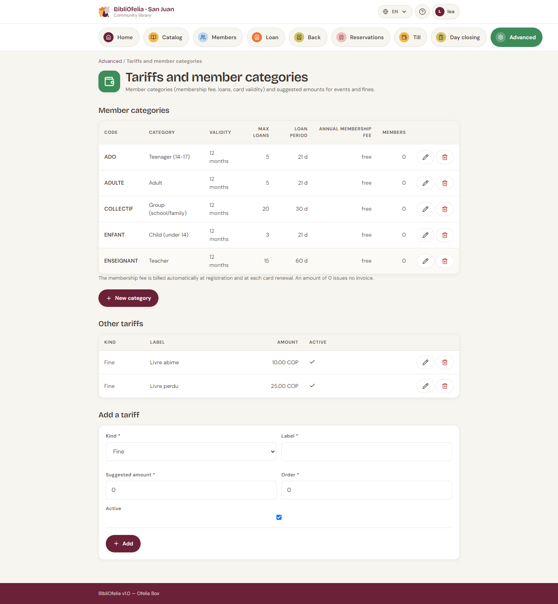

# Fees and member categories

Member categories (Adults, Children, Staff…) and the other amounts
(fines, events) are managed **in the same place**.

**Advanced →
[Fees and member categories](/bibliofelia/en/finance/tariffs/){ target="_blank" }**.

## Member categories

Each row shows: code, name, card validity, max loans, loan duration,
**annual membership fee**, number of members.

- **New category** — code, name in the 4 languages (French is
  required), fee (0 = free), validity, loans, allowed document types.
  No box checked = every type is allowed.
- **Edit** (pencil) — same fields.
- **Delete** (bin) — refused while a member still holds this
  category. Reclassify the profiles first.

The membership fee is billed **automatically** at enrollment and at
each card renewal. A fee of 0 emits no invoice.

!!! info "Changing a member's category"
    On their profile, **Edit** then the new category. Still-open,
    unpaid membership invoices are cancelled; if the new category has
    an amount, a new invoice is issued. A fee already paid is not
    refunded.

## Other fees

Below the categories: fines, events, other charges. These are
**suggestions**: you can still change the amount when billing.

Create, edit, deactivate. A deactivated row leaves the forms but
stays in history.

## Currency

Amounts display in the instance currency (**Advanced → Settings →
Cash desk — currency and due dates**). See
[Cash desk and invoices](caisse.md).

## See also

- [Cash desk and invoices](caisse.md)
- [Enroll a member](../usagers/inscription.md)
- [Renewal and expiration](../usagers/renouvellement.md)
