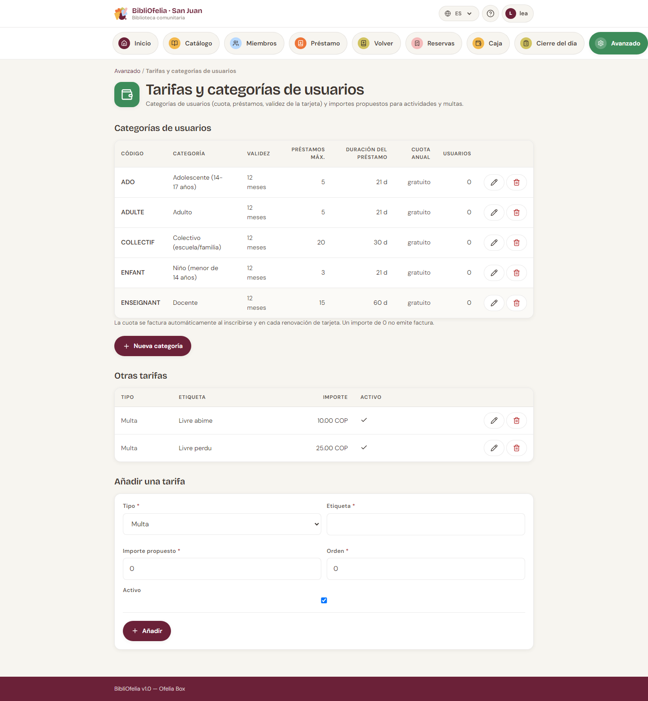

# Tarifas y categorías de usuarios

Las categorías de usuarios (Adultos, Niños, Empleados…) y los demás
importes (multas, animaciones) se gestionan **en el mismo sitio**.

**Avanzado →
[Tarifas y categorías de usuarios](/bibliofelia/es/finance/tariffs/){ target="_blank" }**.

## Categorías de usuarios

Cada fila muestra: código, nombre, validez de la tarjeta, préstamos
máximos, duración, **cuota anual**, número de usuarios.

- **Nueva categoría** — código, nombre en los 4 idiomas (el francés
  es obligatorio), cuota (0 = gratis), validez, préstamos, tipos de
  documento permitidos. Ninguna casilla = todos los tipos.
- **Editar** (lápiz) — los mismos campos.
- **Eliminar** (papelera) — se rechaza mientras un usuario siga en
  esa categoría. Reclasifique las fichas antes.

La cuota se factura **automáticamente** al inscribir y en cada
renovación de tarjeta. Un 0 no emite factura.

!!! info "Cambiar a un usuario de categoría"
    En su ficha, **Editar** y la nueva categoría. Las facturas de
    cuota aún abiertas, sin pago, se anulan; si la nueva categoría
    tiene un importe, se emite una factura nueva. Una cuota ya
    cobrada no se reembolsa.

## Otras tarifas

Bajo las categorías: multas, animaciones, otros gastos. Son
**propuestas**: al facturar puede cambiar el importe.

Crear, editar, desactivar. Una fila desactivada sale de los
formularios pero permanece en el historial.

## Divisa

Los importes se muestran en la divisa de la instancia (**Avanzado →
Ajustes → Caja — divisa y vencimientos**). Véase
[Caja y facturas](caisse.md).

## Véase también

- [Caja y facturas](caisse.md)
- [Inscribir un miembro](../usagers/inscription.md)
- [Renovación y expiración](../usagers/renouvellement.md)
