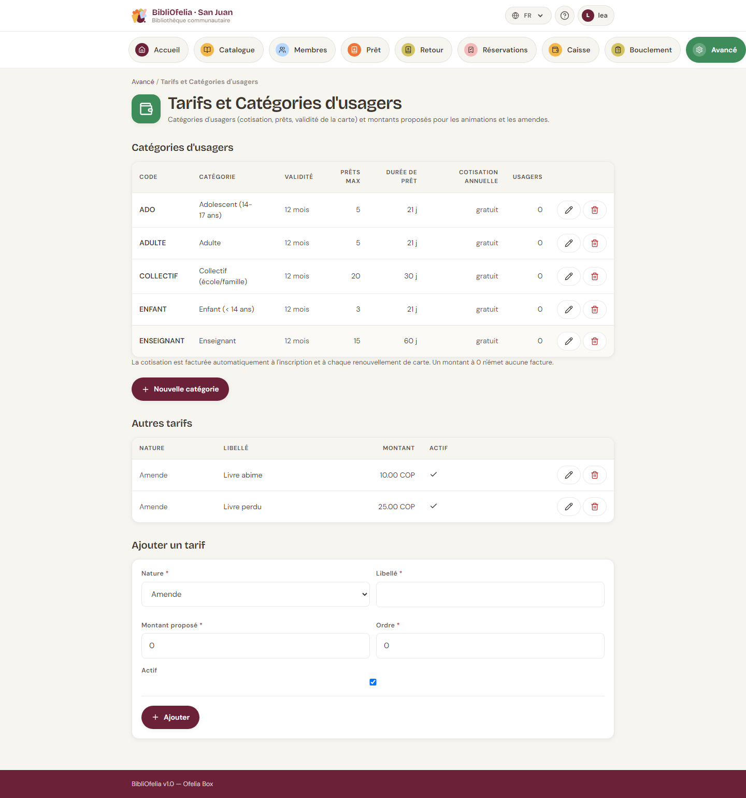

# Tarifs et Catégories d'usagers

Les catégories d'usagers (Adultes, Enfants, Employés…) et les autres
montants (amendes, animations) se gèrent **au même endroit**.

**Avancé →
[Tarifs et Catégories d'usagers](/bibliofelia/fr/finance/tariffs/){ target="_blank" }**.

## Catégories d'usagers

Chaque ligne donne : code, nom, validité de la carte, prêts max,
durée de prêt, **cotisation annuelle**, nombre d'usagers.

- **Nouvelle catégorie** — code, nom dans les 4 langues (le français
  est obligatoire), cotisation (0 = gratuit), validité, prêts, types
  de documents autorisés. Aucune case cochée = tous les types sont
  autorisés.
- **Modifier** (crayon) — mêmes champs.
- **Supprimer** (corbeille) — refusé tant qu'un usager tient encore
  cette catégorie. Désactivez ou reclassez d'abord les fiches.

La cotisation est facturée **automatiquement** à l'inscription et à
chaque renouvellement de carte. Un montant à 0 n'émet aucune facture.

!!! info "Changer un usager de catégorie"
    Sur sa fiche, **Modifier** puis la nouvelle catégorie. Les
    factures de cotisation encore ouvertes, sans paiement, sont
    annulées ; si la nouvelle catégorie a un montant, une nouvelle
    facture est émise. Une cotisation déjà réglée n'est pas
    remboursée.

## Autres tarifs

Sous les catégories : amendes, animations, autres frais. Ce sont des
**propositions** : au moment de facturer, vous pouvez encore changer
le montant.

Créer, modifier, désactiver. Une ligne désactivée disparaît des
formulaires mais reste dans l'historique.

## Devise

Les montants s'affichent dans la devise de l'instance (**Avancé →
Paramètres → Caisse — devise et échéances**). Voir
[Caisse et factures](caisse.md).

## Voir aussi

- [Caisse et factures](caisse.md)
- [Inscrire un membre](../usagers/inscription.md)
- [Renouvellement et expiration](../usagers/renouvellement.md)
