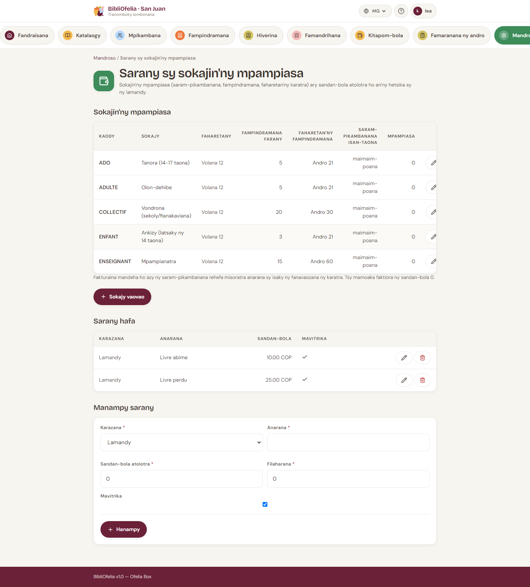

# Saran'ny sokajy mpianatra

Ny sokajy mpianatra (Olon-dehibe, Ankizy, Mpiasa…) sy ny vola hafa
(sazy, animation) dia tantanina **ao amin'ny toerana iray**.

**Avancé →
[Tarifs et Catégories d'usagers](/bibliofelia/mg/finance/tariffs/){ target="_blank" }**.

## Sokajy mpianatra

Ny andalana tsirairay: kaody, anarana, faharetan'ny karatra, fampindramana
max, faharetana, **saram-pianarana isan-taona**, isan'ny mpianatra.

- **Sokajy vaovao** — kaody, anarana amin'ny fiteny 4 (teny frantsay
  tsy maintsy fenoina), saran'ny (0 = maimaim-poana), faharetana,
  karazana boky azo. Tsy misy boaty voamarina = azo daholo.
- **Ovaina** (pencil) — saha mitovy.
- **Fafana** — tsy azo raha mbola misy mpianatra amin'io sokajy io.
  Ovay aloha ny takelaka.

Ny saram-pianarana dia faktiorina **ho azy** amin'ny fisoratana sy
amin'ny fanavaozana karatra. 0 = tsy misy faktiora.

!!! info "Fanovana sokajy"
    Ao amin'ny takelaka, **Ovaina** dia sokajy vaovao. Ny faktiora
    saram-pianarana mbola misokatra, tsy naloa, dia foanana; raha
    manana vola ny sokajy vaovao dia misy faktiora vaovao. Ny vola
    efa naloa dia tsy averina.

## Saran-kafa

Eo ambanin'ny sokajy: sazy, animation, fandaniana hafa. **Tolo-kevitra**
izany: azonao ovaina ny vola amin'ny fotoana faktiora.

Mamorona, ovaina, atsaharo. Ny andalana voajanahary dia miala amin'ny
formulaire fa mijanona ao amin'ny tantara.

## Vola (devise)

Ny vola dia aseho amin'ny devise an'ny instance (**Avancé →
Paramètres → Caisse**). Jereo [Caisse sy faktiora](caisse.md).

## Jereo koa

- [Caisse sy faktiora](caisse.md)
- [Fisoratana mpianatra](../usagers/inscription.md)
- [Fanavaozana sy fahataperana](../usagers/renouvellement.md)
