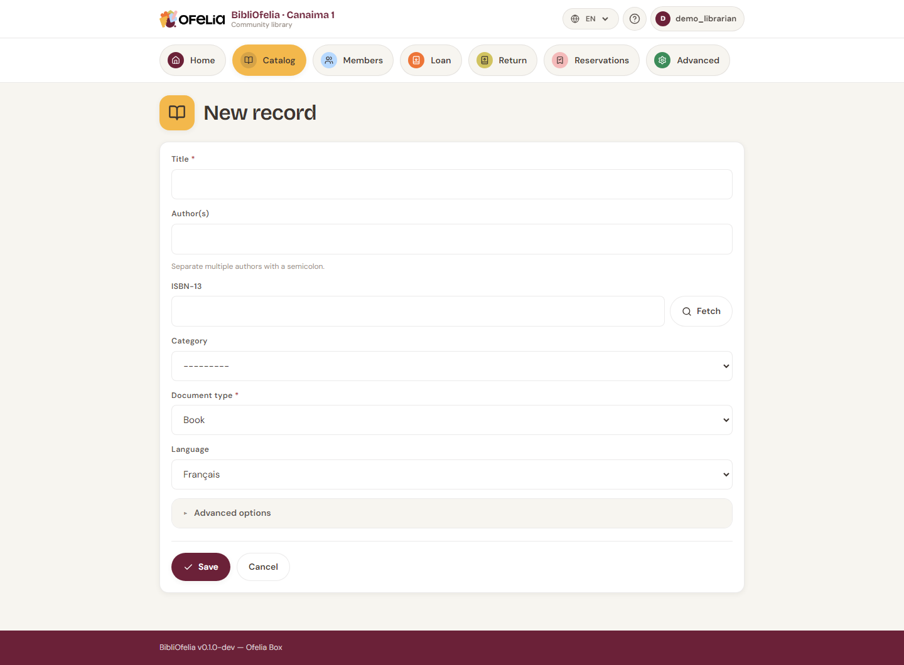

# Adding a book

Before lending a book, you need two things:

1. A **record** (the descriptive entry: title, author, ISBN, etc.)
2. One or more **copies** (the physical items you own)

This page covers step 1. For copies, see
[Managing copies](exemplaires.md).

## Opening the form

From the **Catalog**, click **+ New record** at the top right.

## Quick method: ISBN search

If the book has an ISBN (13-digit code on the back cover), type it in
the **ISBN-13** field and press **Enter**.

BibliOfelia queries the OpenLibrary database and pre-fills the title,
authors, publisher and year. You just need to check and complete.

!!! tip "No internet?"
    OpenLibrary requires internet access. Without a connection, you
    can still type all information manually.

## Manual entry

If no ISBN or no network, fill in the fields by hand:

- **Title** (required)
- **Author(s)** — comma-separated for multiple authors
- **Publisher** — e.g. Gallimard, Hachette…
- **Year of publication**
- **Language** — important for multilingual libraries
- **Category** — Adults, Youth, Documentary… (configured by the
  administrator)
- **Summary** (optional) — short blurb to help readers

## Save

Click **Save**. The record is created and BibliOfelia immediately
offers to **add a first copy**: see [Managing copies](exemplaires.md).

!!! warning "Duplicates"
    If you enter the same ISBN twice, BibliOfelia warns you: do not
    create a new record, instead add an additional copy to the
    existing record (one book, two copies).

## See also

- [Managing copies](exemplaires.md)
- [Search in the catalog](recherche.md)
- [Locations](localisations.md) — where to place the book in the
  library
