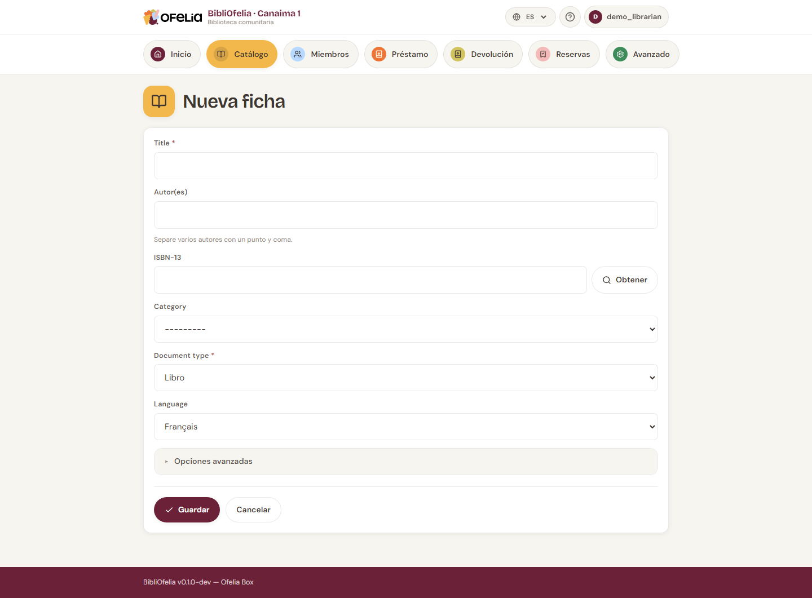

# Añadir un libro

Antes de prestar un libro, necesita dos cosas:

1. Crear un **registro** (la ficha descriptiva del libro: título,
   autor, ISBN, etc.)
2. Crear uno o varios **ejemplares** (las copias físicas que posee)

Esta página explica el paso 1. Para los ejemplares, vea
[Gestionar los ejemplares](exemplaires.md).

## Abrir el formulario

Desde el [**Catálogo**](/bibliofelia/es/catalog/){ target="_blank" }, haga
clic en [**+ Nuevo registro**](/bibliofelia/es/catalog/new/){ target="_blank" }
arriba a la derecha.

## Método rápido: la búsqueda por ISBN

Si el libro tiene un ISBN (código de 13 dígitos en la contraportada),
escríbalo en el campo **ISBN-13** y pulse **Enter**.

BibliOfelia consulta la base de datos OpenLibrary y rellena
automáticamente el título, los autores, el editor y el año. Solo
tiene que verificar y completar.

!!! tip "¿Sin conexión a Internet?"
    OpenLibrary requiere acceso a Internet. Sin conexión, puede
    introducir toda la información manualmente.

## Entrada manual

Si no hay ISBN o no hay red, complete los campos a mano:

- **Título** (obligatorio)
- **Autor(es)** — separe con comas si hay varios
- **Editor** — por ejemplo Gallimard, Hachette…
- **Año de publicación**
- **Idioma** — importante para bibliotecas multilingües
- **Categoría** — Adultos, Juvenil, Documental… (configurada por el
  administrador)
- **Resumen** (opcional) — breve descripción para ayudar a los
  lectores

## Guardar

Haga clic en **Guardar**. El registro se crea y BibliOfelia
inmediatamente le propone **añadir un primer ejemplar**: vea
[Gestionar los ejemplares](exemplaires.md).

!!! warning "Duplicados"
    Si introduce dos veces el mismo ISBN, BibliOfelia le avisa: no
    cree un nuevo registro, mejor añada un ejemplar adicional al
    registro existente (un libro, dos copias).

## Ver también

- [Gestionar los ejemplares](exemplaires.md)
- [Búsqueda en el catálogo](recherche.md)
- [Ubicaciones](localisations.md) — dónde colocar el libro en la
  biblioteca
