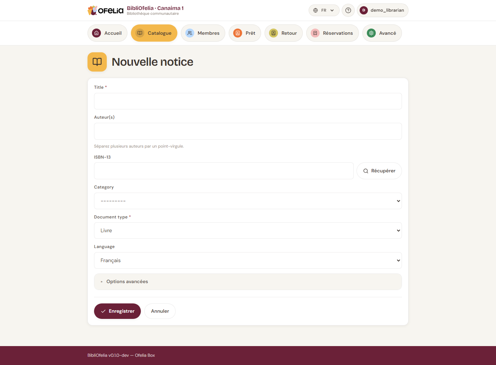

# Ajouter un livre

Avant de pouvoir prêter un livre, il faut deux choses :

1. Créer une **notice** (la fiche descriptive du livre : titre, auteur, ISBN, etc.)
2. Créer un ou plusieurs **exemplaires** (les copies physiques que vous possédez)

Cette page explique l'étape 1. Pour les exemplaires, voir
[Gérer les exemplaires](exemplaires.md).

## Ouvrir le formulaire

Depuis le **Catalogue**, cliquez sur **Nouvelle notice** en haut à droite.

## Méthode rapide : la recherche ISBN

Si le livre a un ISBN (code à 13 chiffres au dos), tapez-le dans le
champ **ISBN-13** et appuyez sur **Entrée**.

BibliOfelia interroge la base de données OpenLibrary et pré-remplit
automatiquement le titre, les auteurs, l'éditeur et l'année. Vous
n'avez plus qu'à vérifier et compléter.

!!! tip "Pas de connexion internet ?"
    OpenLibrary nécessite l'accès à internet. Sans connexion, vous
    pouvez toujours saisir manuellement toutes les informations.

## Saisie manuelle

Si pas d'ISBN ou pas de réseau, remplissez les champs à la main :

- **Titre** (obligatoire) — le titre complet
- **Auteur(s)** — séparez par des virgules pour plusieurs auteurs
- **Éditeur** — par exemple Gallimard, Hachette…
- **Année de publication**
- **Langue** — important pour les bibliothèques multilingues
- **Catégorie** — Adultes, Jeunesse, Documentaire… (configurée par
  l'administrateur)
- **Résumé** (facultatif) — court descriptif pour aider les lecteurs

## Enregistrer

Cliquez sur **Enregistrer**. La notice est créée et BibliOfelia vous
propose immédiatement d'**ajouter un premier exemplaire** : voir
[Gérer les exemplaires](exemplaires.md).

!!! warning "Doublons"
    Si vous saisissez deux fois le même ISBN, BibliOfelia vous prévient
    : ne créez pas une nouvelle notice, ajoutez plutôt un exemplaire
    supplémentaire à la notice existante (un même livre, deux copies).

## Voir aussi

- [Gérer les exemplaires](exemplaires.md)
- [Recherche dans le catalogue](recherche.md)
- [Localisations](localisations.md) — où placer le livre dans la bibliothèque
