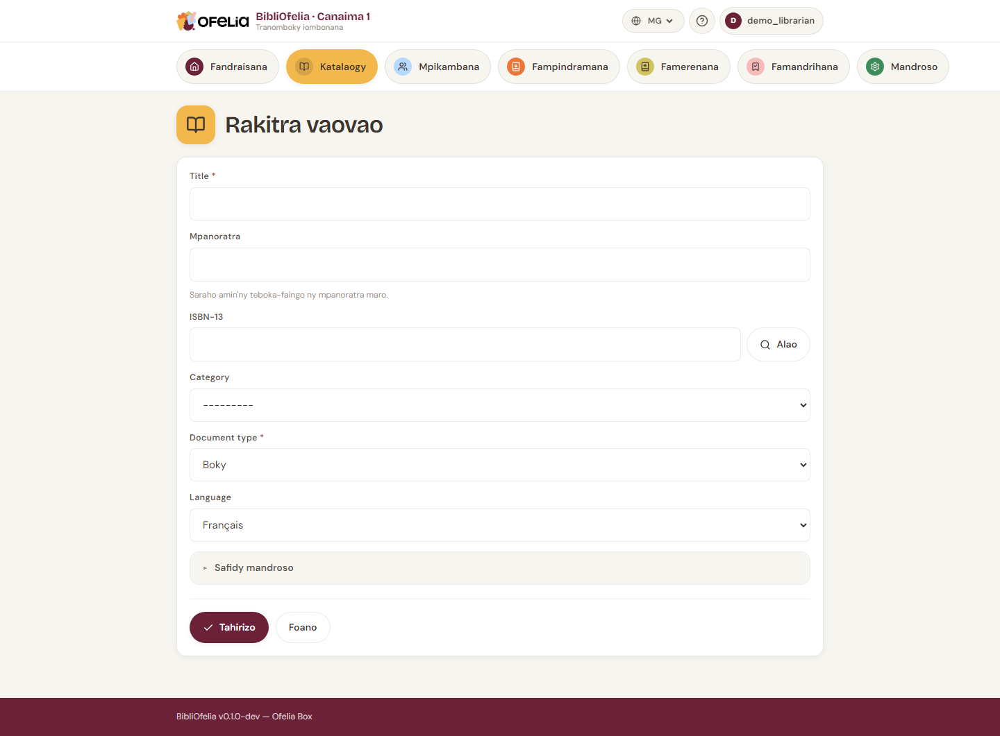

# Manampy boky

Alohan'ny hampindramana boky, mila zavatra roa ianao:

1. Hamorona **notice** (ny takelaka mamaritra ny boky: lohateny,
   mpanoratra, ISBN, sns.)
2. Hamorona **kopia** iray na maro (ny kopia ara-batana ananana)

Ity pejy ity dia manazava ny dingana 1. Ho an'ny kopia, jereo
[Fitantanana kopia](exemplaires.md).

## Sokafy ny formulaire

Avy ao amin'ny **Boky**, click amin'ny **+ Notice vaovao** any
ambony havanana.

## Fomba haingana: fikarohana ISBN

Raha manana ISBN (kaody 13 isa eo amin'ny lafiny ambadika) ilay
boky, soraty eo amin'ny toerana **ISBN-13** dia tsindrio **Enter**.

Ny BibliOfelia dia manontany ny base OpenLibrary ary mameno
automatika ny lohateny, ny mpanoratra, ny editora ary ny taona. Tsy
ilainao afa-tsy mijery sy mameno.

!!! tip "Tsy misy internet?"
    Mila accès internet ny OpenLibrary. Raha tsy misy fifandraisana
    afaka soratanao manokana foana ny vaovao rehetra ianao.

## Fampidirana manokana

Raha tsy misy ISBN na tsy misy réseau, fenoy ny toerana amin'ny
tanana:

- **Lohateny** (tsy maintsy)
- **Mpanoratra(s)** — sarahy amin'ny faingo raha maro
- **Editora** — ohatra Gallimard, Hachette…
- **Taona namoahana**
- **Fiteny** — manandanja ho an'ny tranomboky maro fiteny
- **Sokajy** — Olon-dehibe, Tanora, Filazana… (apetraky ny
  mpitantana)
- **Fintinana** (tsy voatery) — fanazavana fohy hanampiana ny mpamaky

## Tehirizo

Click amin'ny **Tehirizo**. Voaforona ny notice ary ny BibliOfelia
dia manolotra avy hatrany ny **hampiana kopia voalohany**: jereo
[Fitantanana kopia](exemplaires.md).

!!! warning "Doublons"
    Raha mampiditra in-droa ny ISBN mitovy ianao, ny BibliOfelia dia
    mampandre anao: aza mamorona notice vaovao, mampia kopia ho an'ny
    notice efa misy (boky iray, kopia roa).

## Jereo koa

- [Fitantanana kopia](exemplaires.md)
- [Fikarohana ao amin'ny boky](recherche.md)
- [Toerana](localisations.md) — aiza no apetraka ilay boky ao amin'ny
  tranomboky
