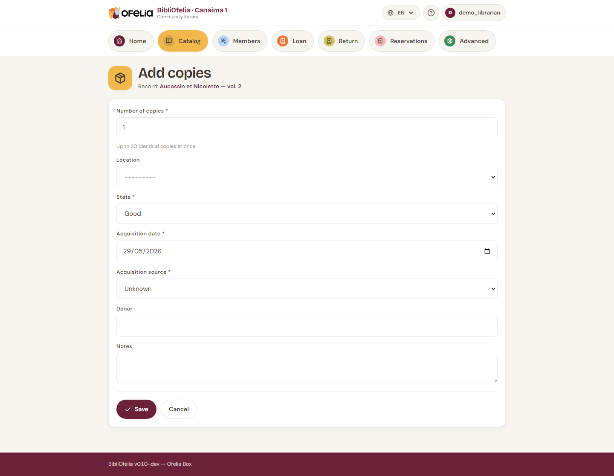

# Managing copies

A **copy** is a physical instance of a book. A record can have one
copy (a rare book), several (a popular book with multiple copies), or
none (a referenced book not yet received).

## Adding a copy

From a record's page, click **+ Add a copy**.

Choose:

- **Location** — the shelf or aisle (see [Locations](localisations.md))
- **Number of copies** — to create several at once
- **Notes** — condition of the book, source, etc.

Click **Create**. Each copy automatically receives:

- A unique **Ofelia code** (starts with 290 — this is the barcode
  printed on the book's label)
- An **internal code** in the form `OFL-YYYYMMDD-NNNN` (visible on the
  record in BibliOfelia, useful to quickly identify the entry date)

See the [glossary](../glossaire.md) for a detailed explanation of the
different codes.

!!! info "Codes are never reused"
    When you delete a copy, its Ofelia code stays "reserved": no new
    copy will ever carry that number. This is important to prevent a
    printed label for a removed book from accidentally becoming valid
    for another book.

## See all copies of a record

The record page displays at the bottom the list of all its copies with
their status: **Available**, **On loan**, **Reserved**, **Lost**,
**Discarded**.

## Editing a copy

Click a copy's row to open its edit form. You can change its location,
add a note, or change its status.

## Discarding a copy

If a copy is too damaged to lend (but not lost), you can **discard**
it: it stays in the database but becomes non-lendable. Use the
**Discard** button on its page.

## Print the labels

To print copy barcodes on physical labels, see
[Book labels](../impressions/etiquettes.md).
