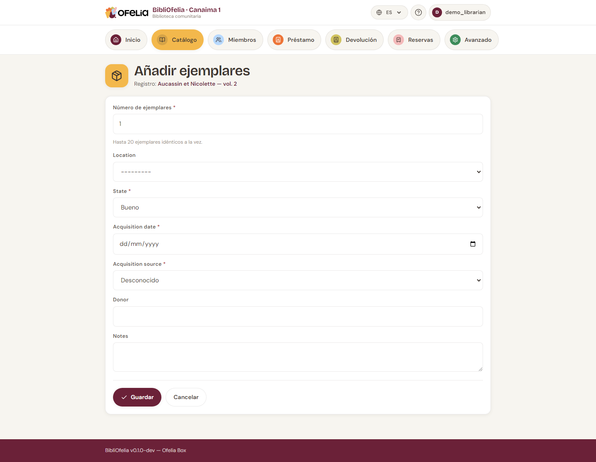

# Gestionar los ejemplares

Un **ejemplar** es una copia física de un libro. Un registro puede
tener un solo ejemplar (un libro raro), varios (libro popular en
varias copias), o ninguno (libro referenciado pero no recibido aún).

## Añadir un ejemplar

Desde la ficha de un registro (página de un libro), haga clic en
**+ Añadir un ejemplar**.

Elija:

- **Ubicación** — la estantería o sección (vea [Ubicaciones](localisations.md))
- **Número de ejemplares** — para crear varios de una vez
- **Notas** — estado del libro, procedencia, etc.

Haga clic en **Crear**. Cada ejemplar recibe automáticamente:

- Un **código Ofelia** único (empieza por 290 — es el código de
  barras que se imprime en la etiqueta del libro)
- Un **código interno** con la forma `OFL-AAAAMMDD-NNNN` (visible
  en la ficha en BibliOfelia, práctico para identificar rápidamente
  la fecha de creación)

Vea el [glosario](../glossaire.md) para entender los distintos
códigos en detalle.

!!! info "El código nunca se reutiliza"
    Cuando elimina un ejemplar, su código Ofelia queda "reservado":
    ningún nuevo ejemplar llevará ese mismo número. Es importante
    para evitar que una etiqueta impresa de un libro retirado pueda
    accidentalmente volverse válida para otro libro.

## Ver todos los ejemplares de un registro

La ficha de un registro muestra abajo la lista de todos sus
ejemplares con su estado: **Disponible**, **Prestado**, **Reservado**,
**Perdido**, **Descartado**.

## Modificar un ejemplar

Haga clic en la línea de un ejemplar para abrir su formulario de
edición. Puede cambiar su ubicación, añadir una nota o modificar su
estado.

## Descartar un ejemplar

Si un ejemplar está demasiado dañado para ser prestado (pero no
perdido), puede **descartarlo**: permanece en la base pero deja de
poder prestarse. Use el botón **Descartar** desde su ficha.

## El código Ofelia externo

Algunos libros llegan con una etiqueta que no es la suya: un fondo prestado
por otra biblioteca, una donación ya catalogada, un inventario anterior a
BibliOfelia. En vez de pegar su etiqueta encima, escriba ese código en el
campo **Código Ofelia externo** del ejemplar (hasta 20 letras o cifras, por
ejemplo `BCF13298781X`).

A partir de ahí, ese código funciona **exactamente como un código Ofelia**:
al prestar, al devolver, en el recuento, en la búsqueda. Puede escribirlo o
escanearlo, con o sin guiones, en mayúsculas o en minúsculas.

!!! warning "Un código, un ejemplar"
    Dos ejemplares no pueden llevar el mismo código externo: BibliOfelia no
    sabría cuál está escaneando. Si el código ya está ocupado, el
    formulario le indica en qué ejemplar se encuentra.

## La procedencia

El campo **Procedencia** dice de dónde viene este ejemplar: comprado por la
biblioteca, donado, prestado por una biblioteca asociada… Se elige de una
lista que usted mismo gestiona (véase [Procedencias](provenances.md)).

La procedencia es lo que permite, llegado el día, localizar **todos** los
libros de un depósito para devolverlos, incluso cuando un mismo título
tiene además un ejemplar que le pertenece.

## Imprimir las etiquetas

Para imprimir los códigos de barras de los ejemplares en etiquetas
físicas, vea [Etiquetas de libros](../impressions/etiquettes.md).
