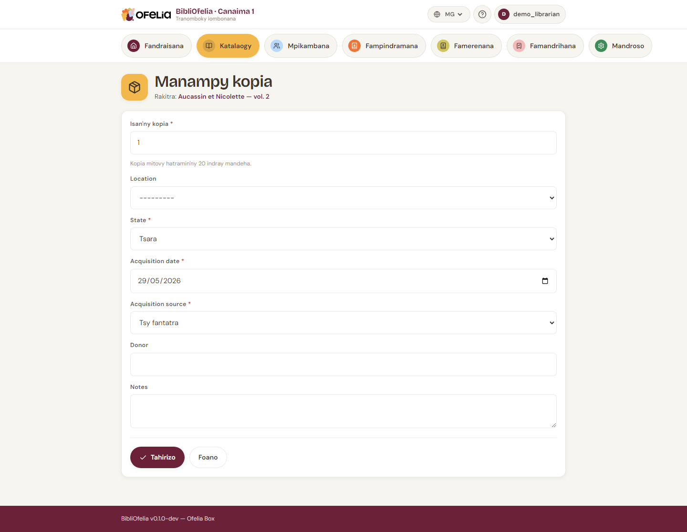

# Fitantanana kopia

**Kopia** dia kopia ara-batana an'ny boky. Notice iray dia afaka
manana kopia tokana (boky sarobidy), maromaro (boky malaza misy
kopia maro), na tsy misy (boky voafaritra fa tsy mbola tonga).

## Hampiana kopia

Avy ao amin'ny takelaka notice (pejy boky iray), click amin'ny
**+ Hampiana kopia**.

Safidio:

- **Toerana** — ny rakitra na vatasalaka (jereo
  [Toerana](localisations.md))
- **Isan'ny kopia** — mba hamorona maro miaraka
- **Notes** — toetran'ny boky, fiaviany, sns.

Click amin'ny **Forono**. Kopia tsirairay dia mahazo automatika:

- **Code Ofelia** miavaka (manomboka amin'ny 290 — io no code-barre
  printy amin'ny etikety boky)
- **Code interne** amin'ny endrika `OFL-AAAAMMDD-NNNN` (hita amin'ny
  takelaka ao amin'ny BibliOfelia, mahasoa mba hahafantarana
  haingana ny dat'an'ny fampidirana)

Jereo ny [voambolana](../glossaire.md) mba hahafantarana tsara ireo
code samihafa.

!!! info "Tsy averina ampiasaina mihitsy ny code"
    Rehefa manafoana kopia ianao dia mijanona "voatahiry" ny code
    Ofelia: tsy hisy kopia vaovao hitondra io laharana io intsony.
    Manan-danja izany mba tsy hahatonga etikety voatonta ho an'ny
    boky nofoanana ho lasa manan-kery ho an'ny boky hafa.

## Jereo ny kopia rehetra an'ny notice iray

Ny takelaka notice dia mampiseho ambany ny lisitry ny kopia rehetra
sy ny toetrany: **Misy**, **Nampindramin'ny olona**, **Voafarana**,
**Very**, **Voafoana**.

## Hanova kopia

Click amin'ny filaharan'ny kopia mba hanokatra ny formulaire
fanovàna. Azonao ovaina ny toerana, ampia note, na ovaina ny
toetra.

## Foanana kopia

Raha simba loatra ny kopia tsy ahafahana nampindramana (fa tsy very),
azonao **foanana**: mijanona ao amin'ny base izy fa lasa tsy azo
ampindramina. Ampiasao ny bokotra **Foanana** avy amin'ny takelakany.

## Atonta ny etikety

Mba hanontana ireo code-barre an'ny kopia amin'ny etikety
ara-batana, jereo [Etikety boky](../impressions/etiquettes.md).
