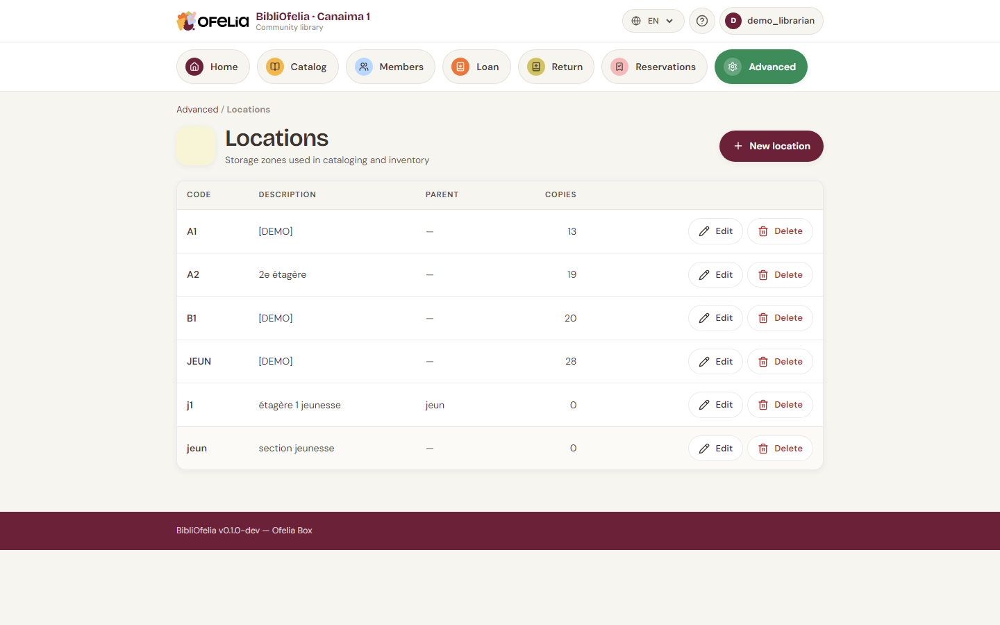
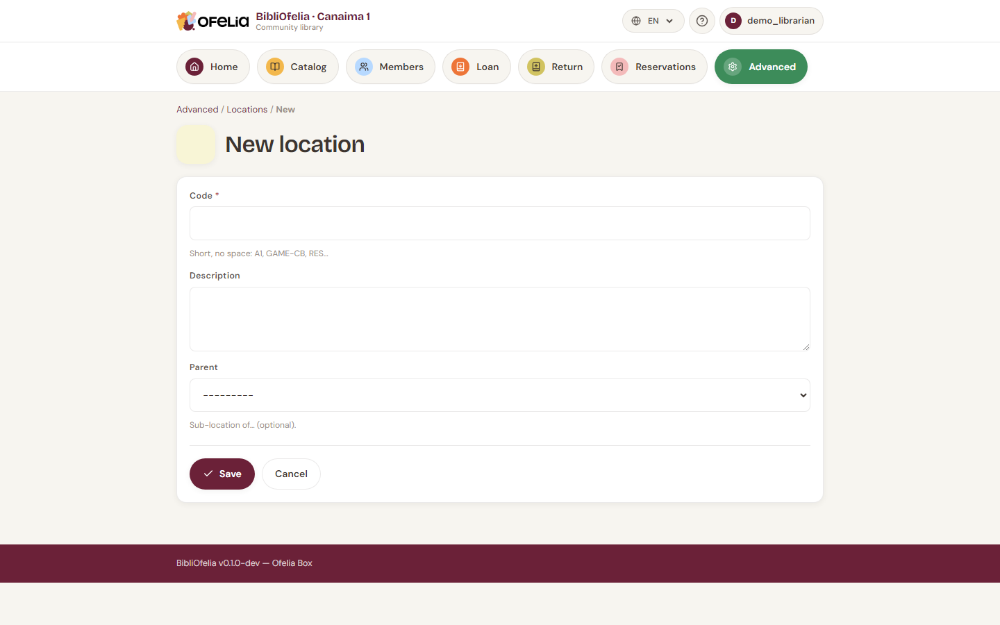

# Locations

**Locations** are the shelves, aisles or rooms where you physically
store books. They help find a copy among others.

## View existing locations

From the **Catalog**, click **Locations** in the menu.

Each location has:

- A short **code** (e.g. `A1`, `YOUTH`, `BD`) for labels and scanning
- An explicit **name** (e.g. "Adult section A1", "Youth section")
- An optional **description**

## Creating a location

Click **+ New location**:

Enter the code and name, then **Save**.

!!! tip "Pick a short, stable code"
    Codes appear on labels and in OfeliaScan. A short code (2-4
    characters) is faster to scan and read. Avoid changing a code
    after printing labels.

## Assigning a copy to a location

When [creating a copy](exemplaires.md), pick its location from the
dropdown. You can also change it later from the copy's page.

## Inventory with automatic relocation

During an inventory with OfeliaScan, if you scan a book in a different
location from the one recorded, BibliOfelia automatically updates the
copy's location. This is the fastest way to refresh your catalog
after a major rearrangement.

See [Inventory](../inventaire/recolement.md).

## Deleting a location

You can only delete a location if it is empty. If copies are still
stored there, move them first (edit each copy, or run an inventory).
