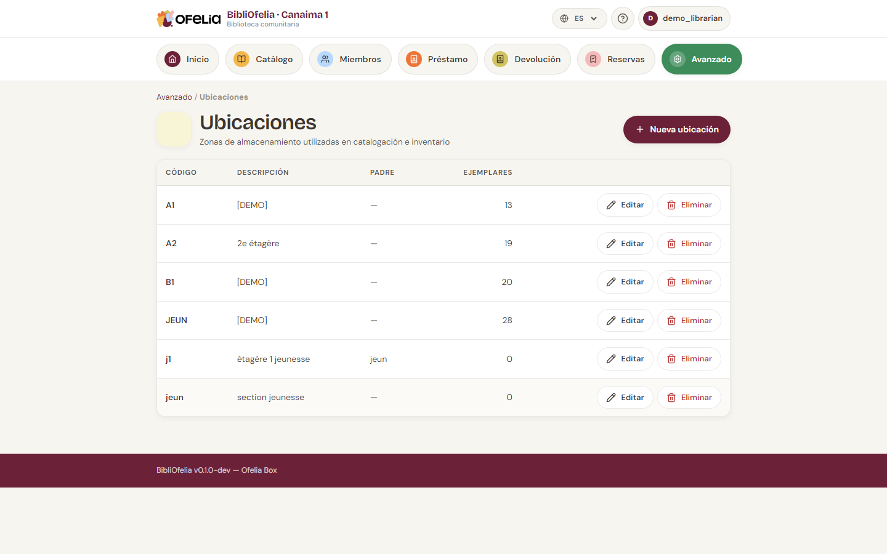
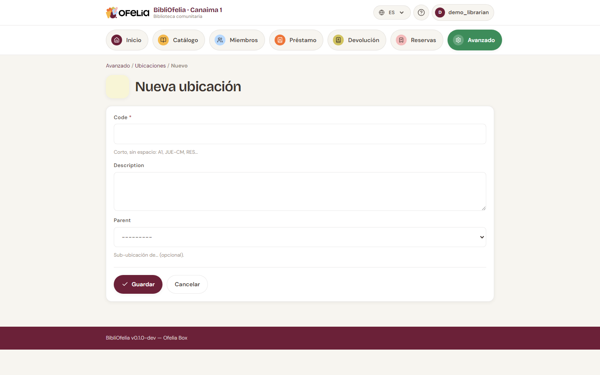

# Ubicaciones

Las **ubicaciones** son las estanterías, secciones o salas donde
guarda físicamente los libros. Ayudan a encontrar un ejemplar entre
los demás.

## Ver las ubicaciones existentes

Desde el **Catálogo**, haga clic en **Ubicaciones** en el menú.

Cada ubicación tiene:

- Un **código** corto (ej. `A1`, `JUV`, `BD`) para etiquetas y
  escaneo
- Un **nombre** explícito (ej. "Sección Adultos A1", "Sección
  Juvenil")
- Una **descripción** opcional

## Crear una ubicación

Haga clic en **+ Nueva ubicación**:

Introduzca el código y el nombre, luego **Guardar**.

!!! tip "Elija un código corto y estable"
    Los códigos aparecen en las etiquetas y en OfeliaScan. Un código
    corto (2-4 caracteres) es más rápido de escanear y leer. Evite
    cambiar un código después de imprimir etiquetas.

## Asignar un ejemplar a una ubicación

Al [crear un ejemplar](exemplaires.md), elija su ubicación en la
lista desplegable. También puede modificarla más tarde desde la
ficha del ejemplar.

## Inventario y reubicación automática

Durante un inventario con OfeliaScan, si escanea un libro en una
ubicación diferente a la registrada, BibliOfelia actualiza
automáticamente la ubicación del ejemplar. Es la forma más rápida de
actualizar su catálogo tras una gran reorganización.

Vea [Inventario OfeliaScan](../ofeliascan/recolement.md).

## Eliminar una ubicación

Solo puede eliminar una ubicación si está vacía. Si todavía hay
ejemplares allí, muévalos primero (edite cada ejemplar, o haga un
inventario).
