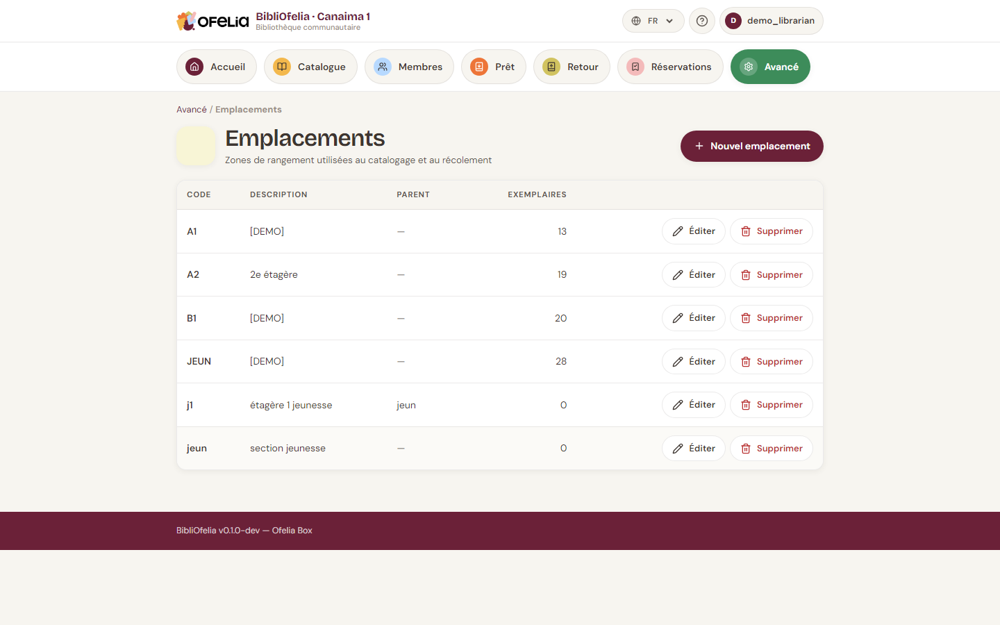
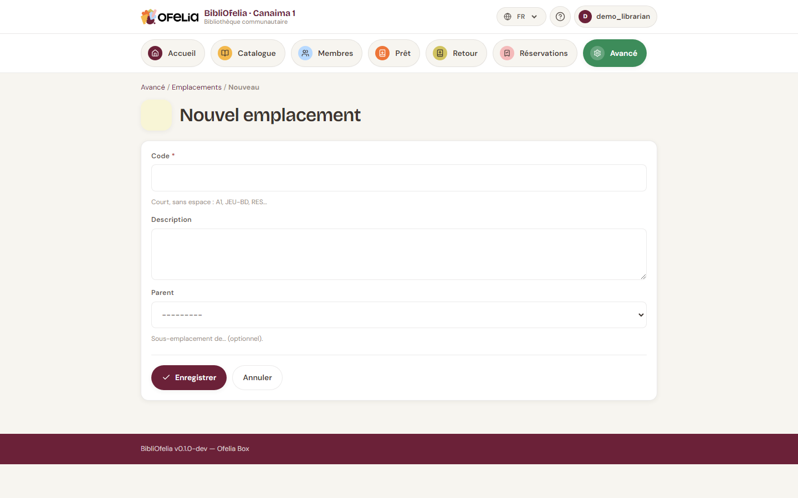

# Localisations

Les **localisations** sont les rayons, étagères ou salles où vous
rangez physiquement les livres. Elles aident à retrouver un exemplaire
parmi les autres.

## Voir les localisations existantes

Depuis le **Catalogue**, cliquez sur **Localisations** dans le menu.

Chaque localisation a :

- Un **code** court (ex. `A1`, `JEUN`, `BD`) pour les étiquettes et le
  scan
- Un **nom** explicite (ex. "Rayon Adultes A1", "Section Jeunesse")
- Une **description** facultative

## Créer une localisation

Cliquez sur **+ Nouvelle localisation** :

Saisissez le code et le nom, puis **Enregistrer**.

!!! tip "Choisir un code court et stable"
    Les codes apparaissent sur les étiquettes et dans OfeliaScan. Un
    code court (2-4 caractères) est plus rapide à scanner et à lire.
    Évitez de changer un code après avoir imprimé des étiquettes.

## Assigner un exemplaire à une localisation

Au moment de [créer un exemplaire](exemplaires.md), choisissez sa
localisation dans la liste déroulante. Vous pouvez aussi la modifier
plus tard depuis la fiche de l'exemplaire.

## Récolement et déplacement automatique

Lors d'un récolement avec OfeliaScan (inventaire), si vous scannez un
livre dans une localisation différente de celle enregistrée,
BibliOfelia met à jour automatiquement la localisation de
l'exemplaire. C'est la façon la plus rapide de remettre votre catalogue
à jour après un grand rangement.

Voir [Récolement OfeliaScan](../ofeliascan/recolement.md).

## Supprimer une localisation

Vous ne pouvez supprimer une localisation que si elle est vide. Si des
exemplaires y sont encore rangés, déplacez-les d'abord (modifiez chaque
exemplaire, ou faites un récolement).
