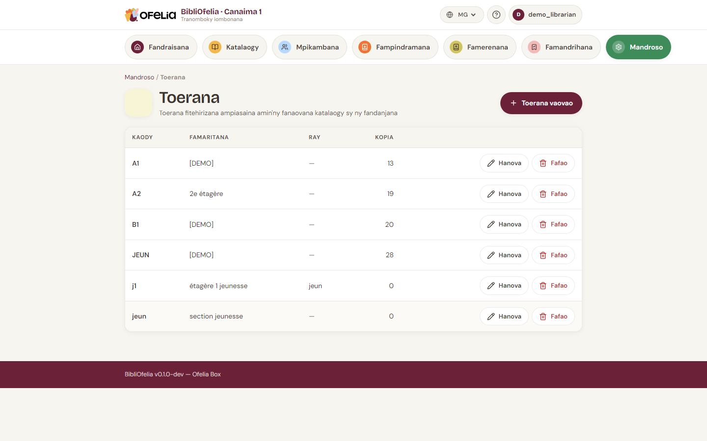
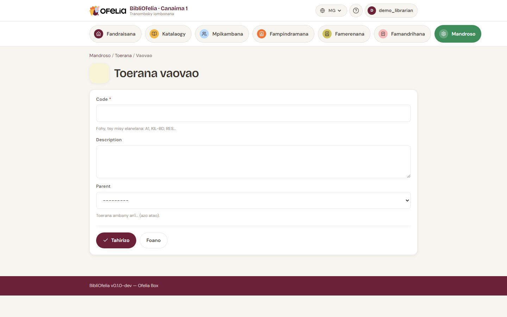

# Toerana

Ny **toerana** dia ny rakitra, vatasalaka na efitra izay
ametrahanao ara-batana ny boky. Manampy hahitana kopia eo amin'ny
hafa.

## Jereo ireo toerana misy

Avy ao amin'ny **Boky**, click amin'ny **Toerana** ao amin'ny menu.

Ny toerana tsirairay dia manana:

- **Code** fohy (ohatra `A1`, `TAN`, `BD`) ho an'ny etikety sy ny
  scan
- **Anarana** mazava (ohatra "Rakitra Olon-dehibe A1", "Fizarana
  Tanora")
- **Famaritana** tsy voatery

## Mamorona toerana

Click amin'ny **+ Toerana vaovao**:

Soraty ny code sy ny anarana, dia **Tehirizo**.

!!! tip "Misafidiana code fohy sy maharitra"
    Ny code dia miseho amin'ny etikety sy amin'ny OfeliaScan. Code
    fohy (2-4 litera) dia haingana kokoa ny scan sy ny famakiana.
    Sorona hanovàna code rehefa avy nanonta etikety.

## Manome kopia ho an'ny toerana

Amin'ny [famoronana kopia](exemplaires.md), safidio ny toerany ao
amin'ny lisitra. Azonao ovaina aorian'ny izany koa avy amin'ny
takelakan'ny kopia.

## Récolement sy fifindra automatika

Mandritra ny récolement amin'ny OfeliaScan, raha mahita boky amin'ny
toerana hafa noho ny voasoratra ianao, ny BibliOfelia dia manavao
automatika ny toeran'ny kopia. Io no fomba haingana indrindra
hanavaozana ny boky aorian'ny fandaminana lehibe.

Jereo [Récolement](../inventaire/recolement.md).

## Foanana toerana

Tsy afaka manafoana toerana ianao raha tsy banga izy. Raha mbola
misy kopia ao, afindrao aloha (hanova kopia tsirairay, na hanao
récolement).
