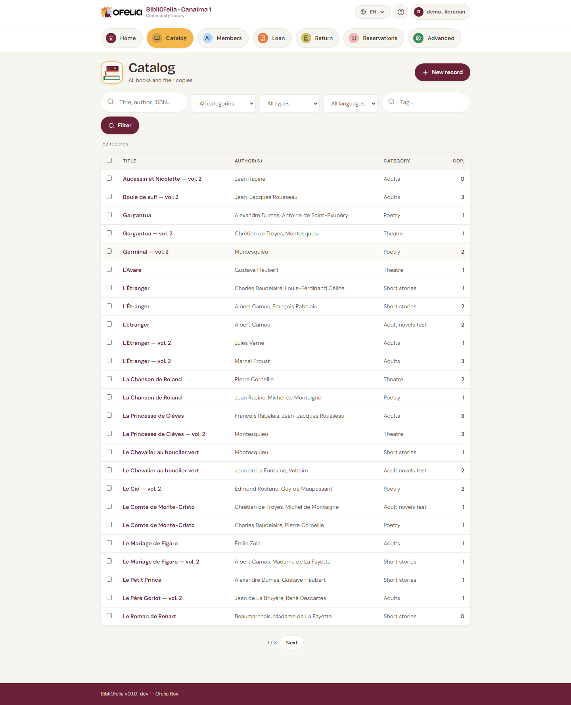

# Search

BibliOfelia provides two complementary search tools: the **global
search** from any page, and the **catalog filter** when you are
already in the book list.

## Global search

At the top of every page, a large search field accepts:

- **A title or a word from the title** — "petit prince", "germinal"
- **An author name** — "hugo", "saint-exupéry"
- **An ISBN-13** — 9782070612758 (publisher's code, on the back of
  the book)
- **A copy Ofelia code** — 2900000000017 (barcode on the BibliOfelia
  label)
- **A member name** — "rakoto", "dubois"
- **A card number** — 2910000000444 (barcode on the card)

BibliOfelia automatically detects what it is (book, member, copy) and
takes you directly to the right page.

!!! tip "Type then Enter"
    No need to click a button: type and press Enter, BibliOfelia
    handles the rest.

## Catalog filter

From the [**Catalog**](/bibliofelia/en/catalog/){ target="_blank" } page, the
record list can be filtered by:

- **Free text** (title, author, publisher)
- **Category** (Adults, Youth, Documentary…)
- **Language**
- **Location**

Filters combine: for example "Adults" + "French" + "Gallimard" to see
only French Gallimard novels for adults.

## A forgiving search

The search is not picky: typing "petit prince" also finds "Le Petit
Prince" and "petits princes". You can write in uppercase or lowercase,
with or without accents, in any order. BibliOfelia handles the rest.

## Search by barcode

With a [scanner](../premiers-pas/saisie.md) or your [device's
camera](../premiers-pas/scanner-camera.md) (camera icon next to the search
bar), you can scan a book's barcode directly: the book or copy page opens
instantly.
