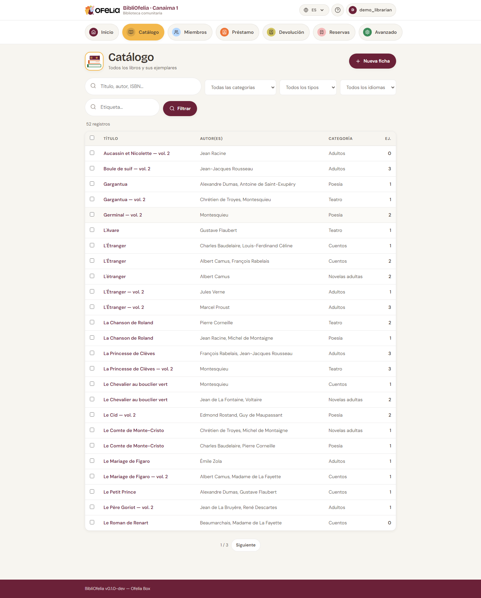

# Búsqueda

BibliOfelia ofrece dos herramientas de búsqueda complementarias: la
**búsqueda global** desde cualquier página, y el **filtro del
catálogo** cuando ya está en la lista de libros.

## La búsqueda global

En la parte superior de cada página, un campo de búsqueda acepta:

- **Un título o una palabra del título** — "petit prince", "germinal"
- **Un nombre de autor** — "hugo", "saint-exupéry"
- **Un ISBN-13** — 9782070612758 (código del editor, al dorso del
  libro)
- **Un código Ofelia de ejemplar** — 2900000000017 (código de barras
  de la etiqueta BibliOfelia)
- **Un nombre de miembro** — "rakoto", "dubois"
- **Un número de tarjeta** — 2910000000444 (código de barras de la
  tarjeta)

BibliOfelia detecta automáticamente de qué se trata (libro, miembro,
ejemplar) y le lleva directamente a la página correcta.

!!! tip "Escriba y pulse Enter"
    No es necesario hacer clic en un botón: escriba y pulse Enter,
    BibliOfelia se encarga del resto.

## El filtro del catálogo

Desde la página **Catálogo**, la lista de registros puede filtrarse
por:

- **Texto libre** (título, autor, editor)
- **Categoría** (Adultos, Juvenil, Documental…)
- **Idioma**
- **Ubicación**

Los filtros se combinan: por ejemplo "Adultos" + "francés" +
"Gallimard" para ver solo las novelas Gallimard en francés para
adultos.

## Una búsqueda tolerante

La búsqueda no es exigente: escribir "petit prince" también
encuentra "Le Petit Prince" y "petits princes". Puede escribir en
mayúsculas o minúsculas, con o sin acentos, en cualquier orden.
BibliOfelia hace el resto.

## Búsqueda por código de barras

Con un [escáner](../premiers-pas/saisie.md) o
[OfeliaScan](../ofeliascan/activer.md), puede escanear directamente
el código de barras de un libro desde cualquier página: la ficha del
libro o del ejemplar se abre al instante.
