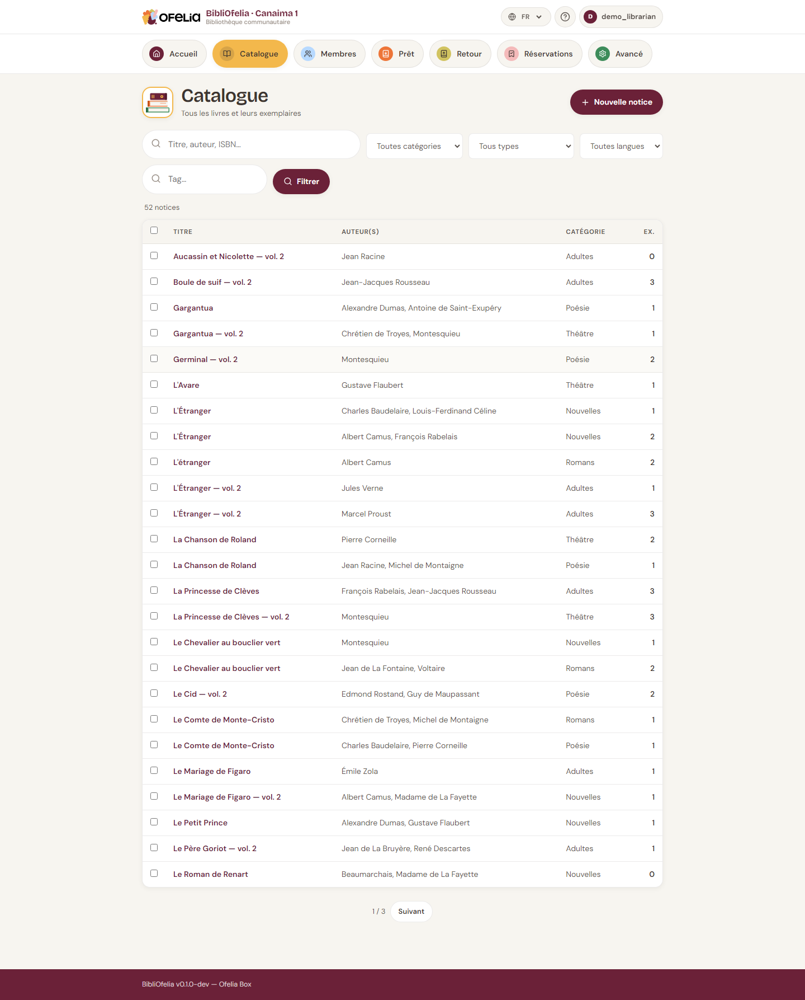

# Recherche

BibliOfelia offre deux outils de recherche complémentaires : la
**recherche globale** depuis n'importe quelle page, et le **filtre du
catalogue** quand vous êtes déjà dans la liste des livres.

## La recherche globale

En haut de chaque page, un grand champ de recherche accepte :

- **Un titre ou un mot du titre** — "petit prince", "germinal"
- **Un nom d'auteur** — "hugo", "saint-exupéry"
- **Un ISBN-13** — 9782070612758 (code de l'éditeur, au dos du livre)
- **Un code Ofelia d'exemplaire** — 2900000000017 (code-barres de
  l'étiquette BibliOfelia)
- **Un nom de membre** — "rakoto", "dubois"
- **Un numéro de carte** — 2910000000444 (code-barres de la carte)

BibliOfelia détecte automatiquement de quoi il s'agit (livre, membre,
exemplaire) et vous emmène directement sur la bonne page.

!!! tip "Tapez puis Entrée"
    Pas besoin de cliquer sur un bouton : tapez et appuyez sur Entrée,
    BibliOfelia s'occupe du reste.

## Le filtre du catalogue

Depuis la page **Catalogue**, la liste des notices peut être filtrée
par :

- **Texte libre** (titre, auteur, éditeur)
- **Catégorie** (Adultes, Jeunesse, Documentaire…)
- **Langue**
- **Localisation**

Les filtres se combinent : par exemple "Adultes" + "français" +
"Gallimard" pour ne voir que les romans Gallimard en français pour
adultes.

## Une recherche tolérante

La recherche n'est pas pointilleuse : taper "petit prince" trouve aussi
"Le Petit Prince" et "petits princes". Vous pouvez écrire en
majuscules ou en minuscules, avec ou sans accents, dans n'importe
quel ordre. BibliOfelia fait le reste.

## Recherche par code-barres

Avec une [douchette](../premiers-pas/saisie.md) ou
[OfeliaScan](../ofeliascan/activer.md), vous pouvez scanner directement
le code-barres d'un livre depuis n'importe quelle page : la fiche du
livre ou de l'exemplaire s'ouvre instantanément.
