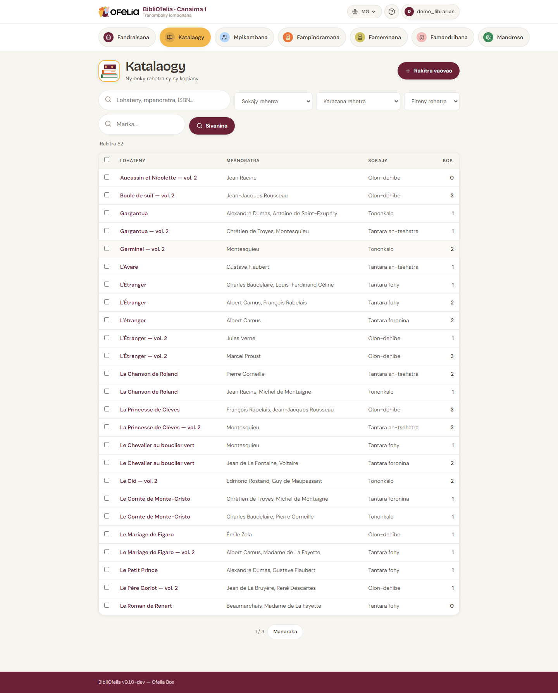

# Fikarohana

Ny BibliOfelia dia manolotra fitaovana fikarohana roa: ny
**fikarohana ankapobeny** avy amin'ny pejy rehetra, sy ny
**fanitana ny boky** rehefa efa ao amin'ny lisitry ny boky ianao.

## Ny fikarohana ankapobeny

Eo ambonin'ny pejy tsirairay, toerana fikarohana lehibe iray mandray:

- **Lohateny na teny iray amin'ny lohateny** — "petit prince",
  "germinal"
- **Anaran'ny mpanoratra** — "hugo", "saint-exupéry"
- **ISBN-13** — 9782070612758 (code an'ny editora, ao amin'ny
  ambadiky ny boky)
- **Code Ofelia an'ny kopia** — 2900000000017 (code-barre an'ny
  etikety BibliOfelia)
- **Kaody Ofelia ivelany** — BCF13298781X (kaody napetraky ny tranomboky
  hafa na ny mpanolotra, raha voasoratrao eo amin'ny kopia)
- **Anaran'ny mpianatra** — "rakoto", "dubois"
- **Laharan'ny karatra** — 2910000000444 (code-barre an'ny karatra)

Ny BibliOfelia dia mahafantatra automatika izay zavatra (boky,
mpianatra, kopia) ary mitondra anao avy hatrany amin'ny pejy
marina.

!!! tip "Soraty dia Enter"
    Tsy mila click amin'ny bokotra: soraty dia tsindrio Enter, ny
    BibliOfelia no mikarakara ny ambiny.

## Ny fanitana ny boky

Avy ao amin'ny pejy [**Boky**](/bibliofelia/mg/catalog/){ target="_blank" },
ny lisitry ny notice dia azo fantenanina araka:

- **Soratra malalaka** (lohateny, mpanoratra, editora)
- **Sokajy** (Olon-dehibe, Tanora, Filazana…)
- **Fiteny**
- **Toerana**

Ny fitana dia miaraka: ohatra "Olon-dehibe" + "frantsay" +
"Gallimard" mba hahitana tantara Gallimard amin'ny frantsay ho an'ny
olon-dehibe ihany.

## Fikarohana tsy be fadiranovana

Tsy be fadiranovana ny fikarohana: ny fanoratana "petit prince" dia
mahita koa ny "Le Petit Prince" sy ny "petits princes". Azonao
atao amin'ny lehibe na kely, misy na tsy misy accent, amin'ny
filaharana inona na inona. Ny BibliOfelia no manao ny ambiny.

## Karohy ny kopia fa tsy ny rakitra

Amin'ny mahazatra dia mampiseho **andalana iray isaky ny boky** (isaky ny
rakitra) ny katalaogy : raha manana kopia telo amin'ny *Andriandahikely*
ianao dia andalana tokana no hitanao, misy « 3 » eo amin'ny tsanganana
**Kop.**

Mifarana amin'ny bokotra roa ny tsipiky ny sivana : mitovy ny fikarohana ataony,
fa samy hafa ny fomba anehoany ny valiny :

- **Karohy ny rakitra** — andalana iray isaky ny boky (ny fahitana mahazatra) ;
- **Karohy ny kopia** — **andalana iray isaky ny kopia**. Hiseho amin'ny
  andalana telo àry ireo kopia telo an'ny *Andriandahikely*.

Asongadina ny bokotry ny fomba ampiasaina : hitanao eo no ho eo àry izay
jerenao. Amin'ny fomba kopia dia solointsanganana telo ilaina ny « Kop. » :

- **Kaody Ofelia** — ny kaody bara eo amin'ny etikety
- **Kaody Ofelia ivelany** — ny kaodin'ny tranomboky hafa, raha misy
- **Fiaviana** — ny niavian'io kopia io

Io ihany no efijery mampiseho fa boky iray ihany dia manana kopia **novidin'ny
tranomboky** sy kopia hafa **nampindramin'ny tranomboky mpiara-miasa**.
Ampiarahо amin'ny sivana **Fiaviana** izy raha te hahita fanangonana
manontolo — ohatra amin'ny andro tsy maintsy hamerenana azy.

!!! tip "Famerenana fanangonana nindramina"
    Mariho **Karohy ny kopia**, sivano araka ny fiaviana, tsindrio **Mariho
    daholo**, avy eo **Hamafa ny kopia voafidy**. Miala amin'ny katalaogy ny
    boky fa mijanona kosa ny rakitra : raha mampindrana ireo lohateny ireo
    indray ny tranomboky mpiara-miasa amin'ny taona ho avy dia tsy misy
    atao afa-tsy ny mamorona kopia vaovao. Jereo ny
    [Fiaviana](provenances.md).

## Fikarohana amin'ny code-barre

Miaraka amin'ny [scanner](../premiers-pas/saisie.md) na ny [fakantsarin'ny
fitaovanao](../premiers-pas/scanner-camera.md) (icône fakantsary eo akaikin'ny
tsipika fikarohana), azonao jereo mivantana ny code-barre an'ny boky: ny
takelakan'ny boky na kopia dia misokatra avy hatrany.
