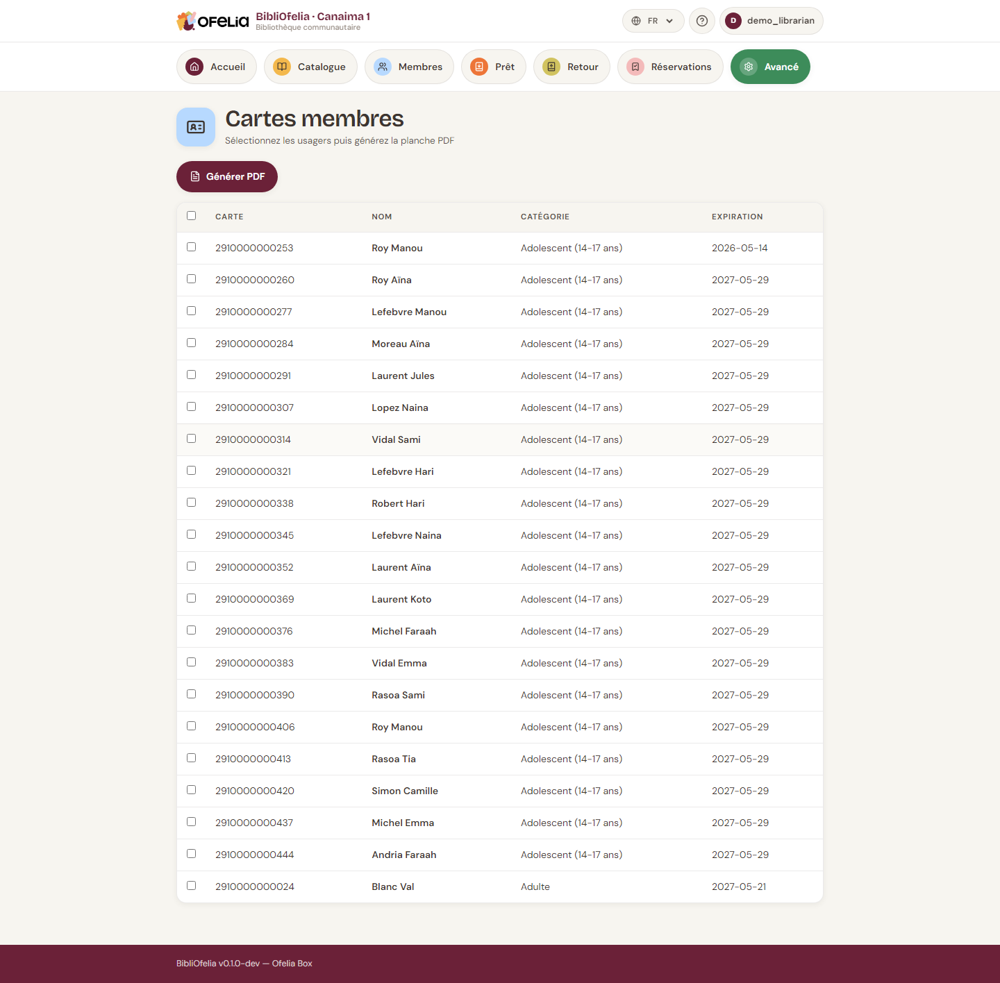

# Imprimer les cartes de membres

Les cartes de membres se génèrent en PDF depuis BibliOfelia. Vous
pouvez en imprimer une seule ou plusieurs d'un coup.

## Ouvrir la page d'impression

**Avancé → Impressions → Cartes**.

## Choisir les cartes à imprimer

La liste affiche tous les membres. Vous pouvez :

- **Filtrer** par catégorie, date d'inscription, statut
- **Cocher** les membres concernés (case en début de ligne)
- **Tout cocher** depuis l'en-tête pour imprimer toutes les cartes
  filtrées d'un coup

## Choisir la langue

Le sélecteur **Langue** en haut détermine la langue affichée sur la
carte (libellés "Carte de membre", "Expire le", etc.). Pratique pour
imprimer des cartes en français pour les francophones et en malagasy
pour les autres.

## Générer le PDF

Cliquez sur **Générer le PDF**. Un nouvel onglet s'ouvre avec le PDF
prêt à imprimer. Chaque page contient plusieurs cartes au format
carte de visite (85 × 54 mm).

## Que contient une carte

- Logo OFELIA en filigrane (fond crème)
- Photo du membre (en haut à gauche si fournie)
- Nom et prénom en grand
- Numéro de carte et code-barres EAN-13
- Date d'expiration
- Drapeau de la langue préférée

## Conseils d'impression

- Papier **200-300 g/m²** pour une carte solide
- **Plastification** ensuite pour la rendre résistante à l'eau et aux
  pliures
- Vous pouvez aussi imprimer sur **étiquettes adhésives** à coller sur
  des cartes pré-imprimées vierges

!!! tip "Imprimer en série pour les nouvelles inscriptions"
    Si vous inscrivez plusieurs membres dans la même journée,
    accumulez-les puis imprimez en lot le soir : moins de gaspillage
    de papier (les cartes se rangent par 6 sur une page A4).

## Voir aussi

- [Inscrire un membre](../usagers/inscription.md)
- [Remplacer une carte perdue](../cas-courants/carte-perdue.md)
