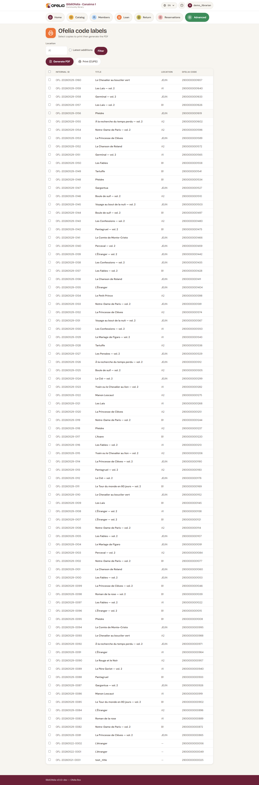

# Print book labels

Barcode labels are stuck on books to allow quick scanning. BibliOfelia
generates the PDF of labels to print on sticky sheets.

## Open the printing page

**Advanced → Printing → Labels**.

## Choose the copies

The list shows all copies without a printed label. Filter and tick
those to include in the PDF.

You can also print labels for already-printed copies (for example if
a label is damaged) by disabling the "Not printed" filter.

## Choose the language

As for cards, the language sets the wording on the label.

## Generate the PDF

Click **Generate PDF**. Label format is **70 × 42 mm** (5 per row,
14 per A4 sheet = 70 labels per page).

## What a label contains

- Discreet OFELIA logo
- Book title (max 2 lines)
- Author(s) (max 2 lines)
- Internal code and EAN-13 barcode
- Location code (aisle)

## Printing tips

- Use **A4 sticky label sheets** in 70 × 42 mm format (Avery L7163 or
  equivalent)
- Check alignment with a **test print** on plain paper first
- If you print many labels in series, plan a **sticking** step with
  several people: it's faster as a pair

## Where to stick the label

Recommended convention:

- **Hardcover books**: on the back cover, bottom right
- **Soft books**: on the cover, bottom right
- **Comics / Albums**: on the back cover, in the least visible corner

Choose a constant placement for all your books: it speeds up scanning
during [inventory](../ofeliascan/recolement.md).

## See also

- [Manage copies](../catalogue/exemplaires.md)
- [OfeliaScan inventory](../ofeliascan/recolement.md)
