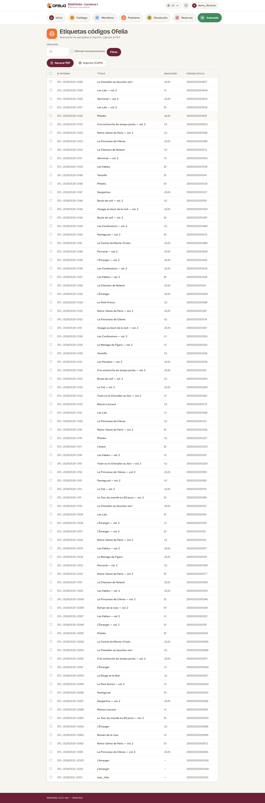

# Imprimir las etiquetas de libros

Las etiquetas con códigos de barras se pegan en los libros para
permitir su escaneo rápido. BibliOfelia genera el PDF de las
etiquetas a imprimir en planchas autoadhesivas.

## Abrir la página de impresión

**Avanzado → Impresión →
[Etiquetas](/bibliofelia/es/printing/labels/){ target="_blank" }**.

## Elegir los ejemplares

La lista muestra todos los ejemplares sin etiqueta impresa. Filtre y
marque los que incluir en el PDF.

También puede imprimir etiquetas para ejemplares ya impresos (por
ejemplo si una etiqueta está dañada) desactivando el filtro "No
impresos".

## Elegir el idioma

Como para las tarjetas, el idioma determina las etiquetas en la
etiqueta.

## Generar el PDF

Haga clic en **Generar el PDF**. El formato de las etiquetas es
**70 × 42 mm** (5 por línea, 14 por plancha A4 = 70 etiquetas por
página).

## Qué contiene una etiqueta

- Logo OFELIA discreto
- Título del libro (en 2 líneas máx.)
- Autor(es) (en 2 líneas máx.)
- Código interno y código de barras EAN-13
- Código de ubicación (estante)

## Consejos de impresión

- Use **planchas de etiquetas adhesivas A4** en formato 70 × 42 mm
  (Avery L7163 o equivalente)
- Verifique la alineación con una **impresión de prueba** en papel
  ordinario primero
- Si imprime muchas etiquetas en serie, prevea una etapa de
  **pegado** con varias personas: es más rápido de a dos

## Dónde pegar la etiqueta

La convención recomendada:

- **Libros encuadernados**: en la contracubierta, abajo a la derecha
- **Libros blandos**: en la cubierta, abajo a la derecha
- **Cómics / Álbumes**: en la contracubierta, en la esquina menos
  visible

Elija una ubicación constante para todos sus libros: facilita el
escaneo durante el [inventario](../inventaire/recolement.md).

## Imprimir en una impresora de cinta (Brother QL-810W)

Si su equipo tiene una **Brother QL-810W** conectada por USB con una
cinta continua de 62 mm, aparece un segundo botón: **Cinta de 62 mm
(Brother QL)**. Imprime una etiqueta a la vez, sin lámina A4 ni
desperdicio de papel.

1. Marque los ejemplares y haga clic en **Cinta de 62 mm (Brother QL)**.
2. El PDF se abre en una pestaña nueva. Inicie la impresión (**Ctrl+P** o el
   botón de impresión del visor).
3. En el diálogo: impresora **Brother QL-810W**, papel **62 mm**, orientación
   **vertical**, escala **100 %** (nunca «ajustar a la página»).

Cada etiqueta se imprime en su propia página: la impresora corta entre cada
una.

Cada etiqueta mide **62 × 35 mm**: logotipo y nombre de la biblioteca arriba,
título en dos líneas, autor en cursiva, código de barras y, abajo, el código
Ofelia y el código de estantería.

!!! tip "La etiqueta sale solo en negro"
    El rojo de la cinta bicolor (DK-22251) se reserva para las tarjetas de
    socio. En una etiqueta el código de barras debe seguir en negro: una barra
    roja ya no la lee el lector.

## Ver también

- [Gestionar los ejemplares](../catalogue/exemplaires.md)
- [Inventario](../inventaire/recolement.md)
