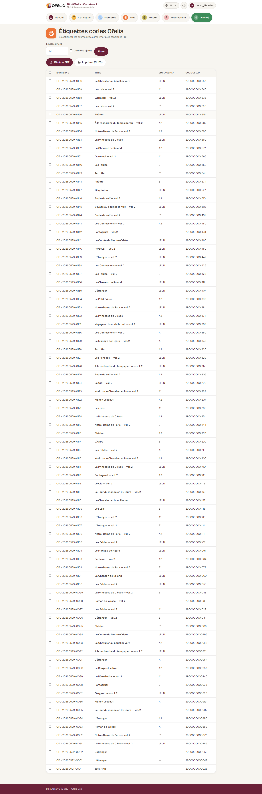

# Imprimer les étiquettes de livres

Les étiquettes-codes-barres se collent sur les livres pour permettre
leur scan rapide. BibliOfelia génère le PDF des étiquettes à imprimer
sur planches autocollantes.

## Ouvrir la page d'impression

**Avancé → Impressions →
[Étiquettes](/bibliofelia/fr/printing/labels/){ target="_blank" }**.

## Choisir les exemplaires

La liste affiche tous les exemplaires sans étiquette imprimée.
Filtrez et cochez ceux à inclure dans le PDF.

Vous pouvez aussi imprimer des étiquettes pour des exemplaires déjà
imprimés (par exemple si une étiquette est abîmée) en désactivant le
filtre "Non imprimés".

## Choisir la langue

Comme pour les cartes, la langue détermine les libellés sur
l'étiquette.

## Générer le PDF

Cliquez sur **Générer le PDF**. Le format des étiquettes est
**70 × 42 mm** (5 par ligne, 14 par planche A4 = 70 étiquettes par
page).

## Que contient une étiquette

- Logo OFELIA discret
- Titre du livre (sur 2 lignes max)
- Auteur(s) (sur 2 lignes max)
- Code interne et code-barres EAN-13
- Code de localisation (rayon)

## Conseils d'impression

- Utilisez des **planches d'étiquettes adhésives A4** format 70 × 42 mm
  (Avery L7163 ou équivalent)
- Vérifiez l'alignement avec une **impression test** sur papier ordinaire
  d'abord
- Si vous imprimez beaucoup d'étiquettes en série, prévoyez une étape
  de **collage** avec plusieurs personnes : c'est plus rapide à deux

## Où coller l'étiquette

La convention recommandée :

- **Livres reliés** : sur le quatrième de couverture, en bas à droite
- **Livres souples** : sur la couverture, en bas à droite
- **BD / Albums** : sur le quatrième de couverture, dans le coin le
  moins visible

Choisissez un emplacement constant pour tous vos livres : ça facilite
le scan pendant le [récolement](../inventaire/recolement.md).

## Voir aussi

- [Gérer les exemplaires](../catalogue/exemplaires.md)
- [Récolement](../inventaire/recolement.md)
