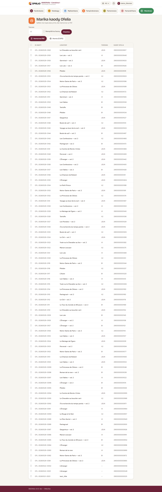

# Manonta etikety boky

Ny etikety code-barre dia mipetaka amin'ny boky mba hahafahana
mijery azy haingana. Ny BibliOfelia dia mamorona ny PDF an'ny
etikety hatontana amin'ny taratasy miankina.

## Sokafy ny pejy fanontana

**Mandroso → Fanontana →
[Etikety](/bibliofelia/mg/printing/labels/){ target="_blank" }**.

## Safidio ireo kopia

Ny lisitra dia mampiseho ny kopia rehetra tsy mbola misy etikety
voatonta. Mifitana sy marino izay tianao tafiditra ao amin'ny PDF.

Azonao koa atao ny manonta etikety ho an'ny kopia efa voatonta
(ohatra raha simba ny etikety) amin'ny famonoana ny fitana "Tsy
voatonta".

## Safidio ny fiteny

Toy ny ho an'ny karatra, ny fiteny dia mametra ny étiquette amin'ny
etikety.

## Hamorona PDF

Click amin'ny **Hamorona ny PDF**. Ny endriky ny etikety dia
**70 × 42 mm** (5 isaky ny filaharana, 14 isaky ny taratasy A4 =
70 etikety isam-pejy).

## Inona no ao amin'ny etikety

- Logo OFELIA tsy mibahan-toerana
- Lohatenin'ny boky (amin'ny filaharana 2 farafahabetsany)
- Mpanoratra(s) (amin'ny filaharana 2 farafahabetsany)
- Code interne sy code-barre EAN-13
- Code toerana (rakitra)

## Toro hevitra amin'ny fanontana

- Ampiasao **taratasy etikety miankina A4** amin'ny endrika 70 × 42
  mm (Avery L7163 na mitovy)
- Hamarino ny fifandanjana amin'ny **fanontana fitsapana** amin'ny
  taratasy mahazatra aloha
- Raha manonta etikety maro mitanjozotra ianao, omeo dingana
  **fametahana** miaraka amin'ny olona maro: haingana kokoa raha
  roa

## Aiza no apetaka ny etikety

Ny convention atolotra:

- **Boky mafy**: eo amin'ny ambadiky ny couverture, ambany havanana
- **Boky malefaka**: eo amin'ny couverture, ambany havanana
- **BD / Album**: eo amin'ny ambadika, eo amin'ny zorony tsy hita
  loatra

Safidio toerana mitovy ho an'ny boky rehetra: mampihaingana ny scan
mandritra ny [récolement](../inventaire/recolement.md).

## Jereo koa

- [Fitantanana kopia](../catalogue/exemplaires.md)
- [Récolement](../inventaire/recolement.md)
