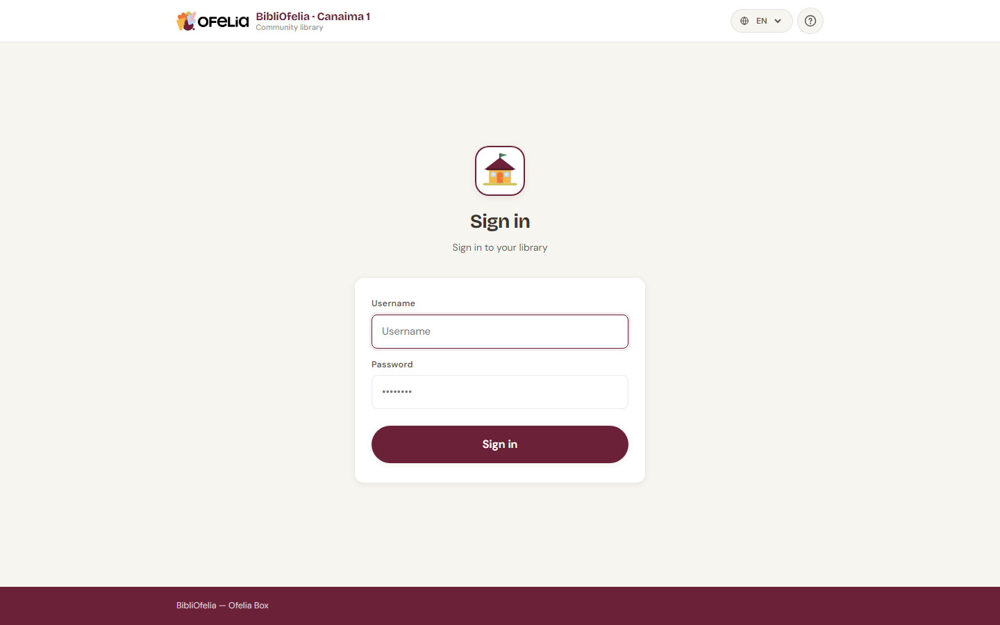

# Sign in

To use BibliOfelia, open your web browser and go to the Ofelia Box
address (usually `http://ofelia.local/bibliofelia/` or the IP address
your administrator provided).

## Enter your credentials

Type your username and password in the two fields, then click
**Sign in**.

!!! tip "Don't have credentials?"
    Accounts cannot be created by librarians themselves. Ask the Box
    administrator to create one for you.

!!! info "Forgot your password?"
    BibliOfelia works offline and does not send emails: the
    administrator must reset your password directly from the Box.

## Security: limited attempts

To protect the library, after several incorrect password attempts your
account is temporarily blocked. If this happens, wait a few minutes or
ask the administrator to unblock the account.

## Next?

Once signed in, you land on the [dashboard](dashboard.md), your
starting point for all daily operations.
