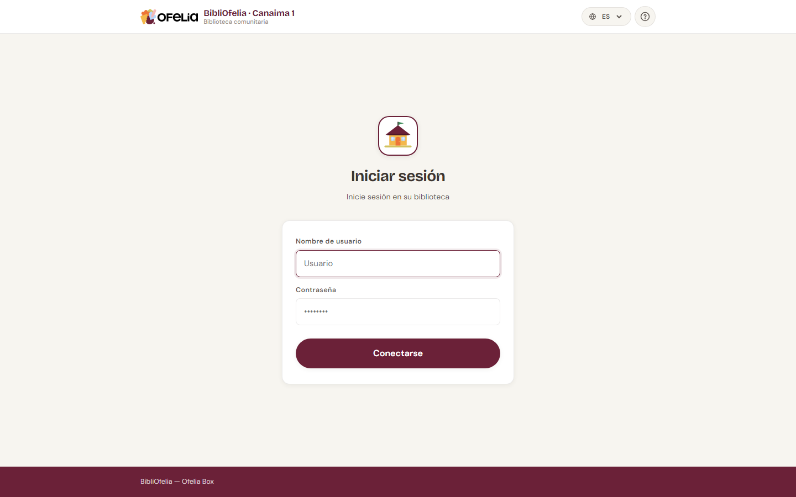

# Iniciar sesión

Para usar BibliOfelia, abra su navegador web y vaya a la dirección de
la Ofelia Box (generalmente `http://ofelia.local/bibliofelia/` o la
dirección IP que el administrador le indicó).

## Introducir sus credenciales

Escriba su nombre de usuario y contraseña en los dos campos, luego
haga clic en **Iniciar sesión**.

!!! tip "¿No tiene credenciales?"
    Las cuentas no pueden ser creadas por los bibliotecarios mismos.
    Pida al administrador de la Box que cree una para usted.

!!! info "¿Olvidó su contraseña?"
    BibliOfelia funciona sin conexión y no envía correos: el
    administrador debe restablecer su contraseña directamente desde
    la Box.

## Seguridad: intentos limitados

Para proteger la biblioteca, después de varios intentos con
contraseña incorrecta su cuenta se bloquea temporalmente. Si esto
ocurre, espere unos minutos o pida al administrador que desbloquee
la cuenta.

## ¿Y después?

Una vez conectado, llega al [panel](dashboard.md), su punto de
partida para todas las operaciones diarias.
