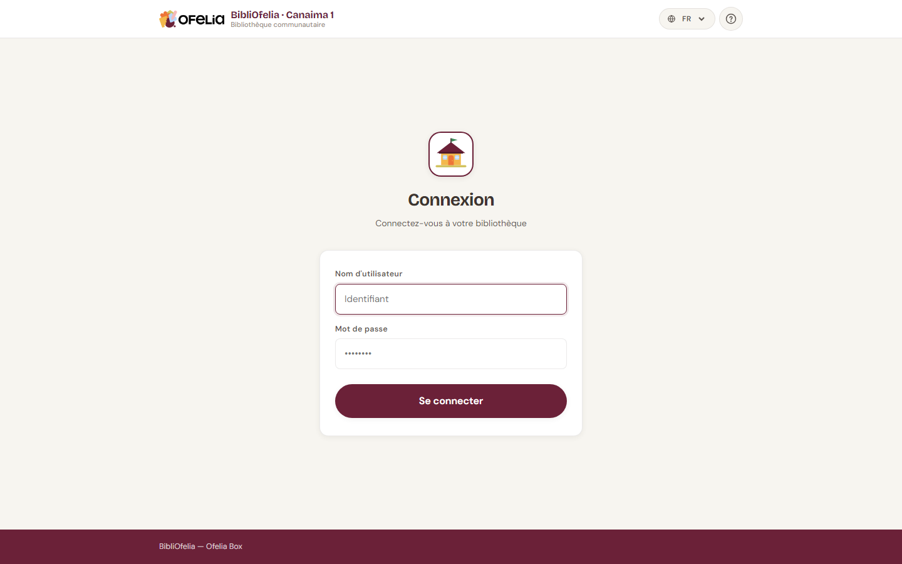

# Se connecter

Pour utiliser BibliOfelia, ouvrez votre navigateur web et rendez-vous à
l'adresse de la Ofelia Box (souvent `http://ofelia.local/bibliofelia/`
ou l'adresse IP que l'administrateur vous a communiquée).

## Saisir vos identifiants

Tapez votre identifiant et votre mot de passe dans les deux champs, puis
cliquez sur **Se connecter**.

!!! tip "Vous n'avez pas vos identifiants ?"
    Les comptes ne peuvent pas être créés par les bibliothécaires
    eux-mêmes. Demandez à l'administrateur de la Box de vous en créer un.

!!! info "Mot de passe oublié ?"
    BibliOfelia fonctionne hors ligne et n'envoie pas d'email :
    l'administrateur doit réinitialiser votre mot de passe directement
    depuis la Box.

## Sécurité : essais limités

Pour protéger la bibliothèque, après plusieurs essais de mot de passe
incorrect votre compte est bloqué temporairement. Si cela vous arrive,
attendez quelques minutes ou demandez à l'administrateur de débloquer
le compte.

## Et après ?

Une fois connecté, vous arrivez sur le [tableau de bord](dashboard.md),
votre point de départ pour toutes les opérations courantes.
