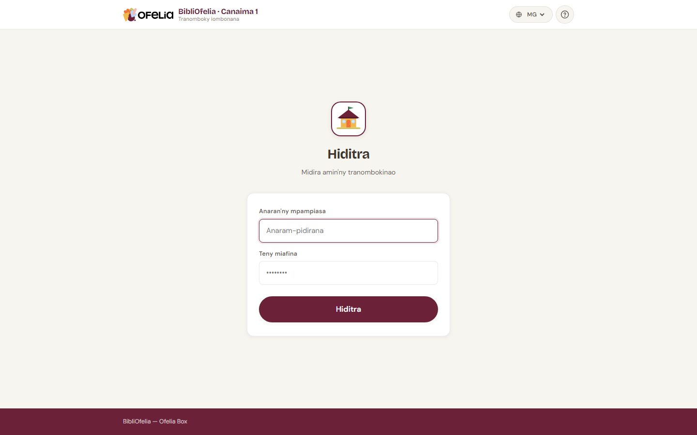

# Fidirana

Mba hampiasana ny BibliOfelia, sokafy ny navigateur web ary mandehana
amin'ny adiresy an'ny Ofelia Box (matetika
`http://ofelia.local/bibliofelia/` na ny adiresy IP nomen'ny
mpitantana anao).

## Ampidiro ny anaranao sy ny tenimiafinao

Soraty ny anaranao sy ny tenimiafinao ao anaty toerana roa, dia
tsindrio **Hiditra**.

!!! tip "Tsy manana anarana sy tenimiafina ianao?"
    Ny mpitantana tranomboky dia tsy afaka mamorona kaonty ho an'ny
    tenany. Angataho amin'ny mpitantana ny Box mba hamorona iray ho
    anao.

!!! info "Hadinonao ny tenimiafinao?"
    Ny BibliOfelia dia miasa tsy misy internet ary tsy mandefa
    mailaka: ny mpitantana ihany no afaka mamerina ny tenimiafinao
    amin'ny Box mivantana.

## Fiarovana: fetra amin'ny andrana

Mba hiarovana ny tranomboky, rehefa avy andrana imbetsaka miaraka
amin'ny tenimiafina diso ny kaontinao dia voasakana vonjimaika. Raha
mitranga izany, miandrasa minitra vitsivitsy na angataho amin'ny
mpitantana mba hanafaka ny kaonty.

## Avy eo?

Rehefa tafiditra ianao dia tonga amin'ny [tabilao](dashboard.md), ny
toerana iaingana amin'ny asa rehetra isan'andro.
