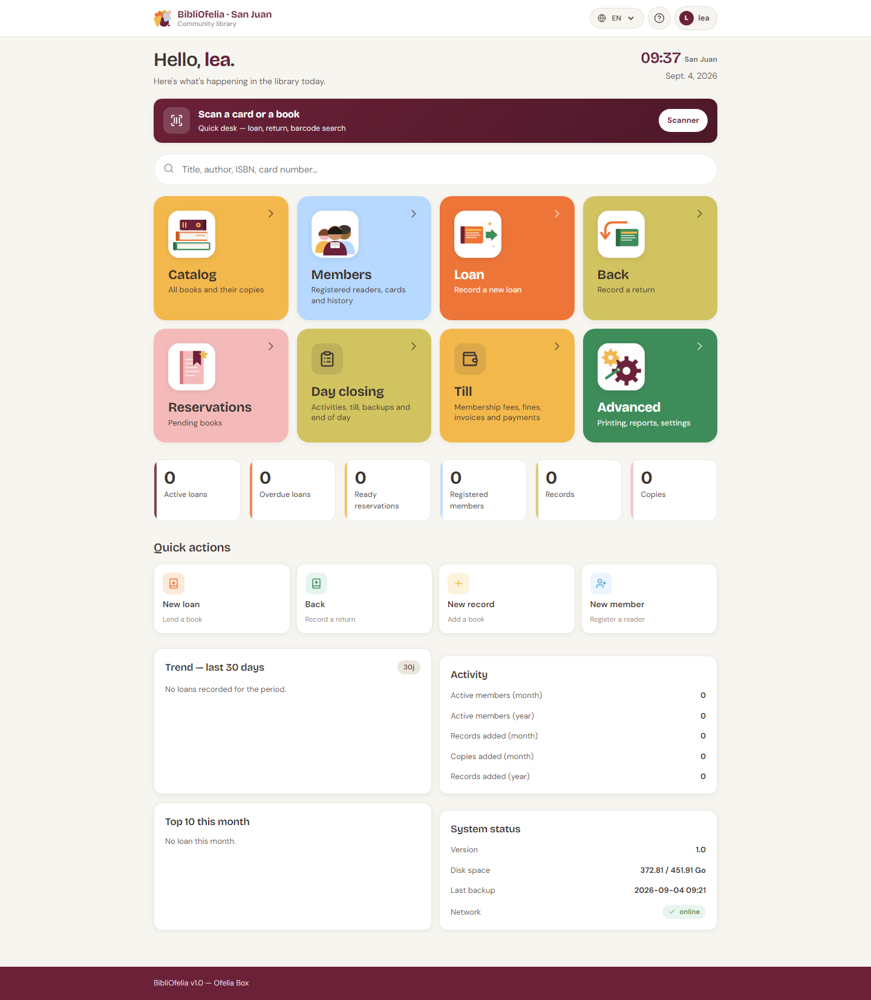

# Dashboard tour

The dashboard is the home page of BibliOfelia. It brings together
everything you need day to day.

## The big tiles at the top

The three large colored tiles are the main sections:

- [**Catalog**](/bibliofelia/en/catalog/){ target="_blank" } (orange) — all
  books and their copies
- [**Members**](/bibliofelia/en/members/){ target="_blank" } (blue) — enrolled
  readers, their cards, their history
- [**Advanced**](/bibliofelia/en/advanced/){ target="_blank" } (green) —
  printing, reports, settings

The [**Lend**](/bibliofelia/en/loans/lend/){ target="_blank" } and
[**Return**](/bibliofelia/en/loans/return/){ target="_blank" } tiles are also
reachable from the top navigation bar on every page: they are the most
frequent actions, always one click away.

Two more tiles at the same level:

- [**Cash desk**](/bibliofelia/en/finance/){ target="_blank" } — till
  balance, invoices, payments (see
  [Cash desk and invoices](../caisse/caisse.md))
- [**Closing**](/bibliofelia/en/closing/){ target="_blank" } — end of
  service: activities, today's till, emails, backup, Box shutdown
  (see [End-of-day closing](../caisse/bouclement.md))

## The counters

Below the tiles, six numbers summarize the current activity:

- **Active loans** — books currently borrowed
- **Overdue loans** — loans past their return date
- **Reservations ready** — reserved books that have arrived
- **Members enrolled** — total active cards
- **Records** — book entries in the catalog
- **Copies** — physical copies in the library

## Quick actions

Four shortcuts for secondary actions: **Enrollment** (new member),
**Return**, **New record** (add a book), **New member**.

## Trend, activity, system status

Further down, three informative cards:

- **Trend — last 30 days**: activity curve
- **Activity**: counters of active members, records and copies added
  for the month and the year
- **System status**: version, disk space, last backup, network

## Follow-ups

At the bottom, the **Follow-ups** section lists the most overdue loans
with the member's name, the missed due date and the number of days
late. Clicking a row opens the member's profile.

!!! tip "Scanner shortcut"
    The **Scan a card or a book** banner in the middle of the dashboard
    opens your [device's camera](scanner-camera.md) to read a barcode
    directly and land on the right page without navigating.
