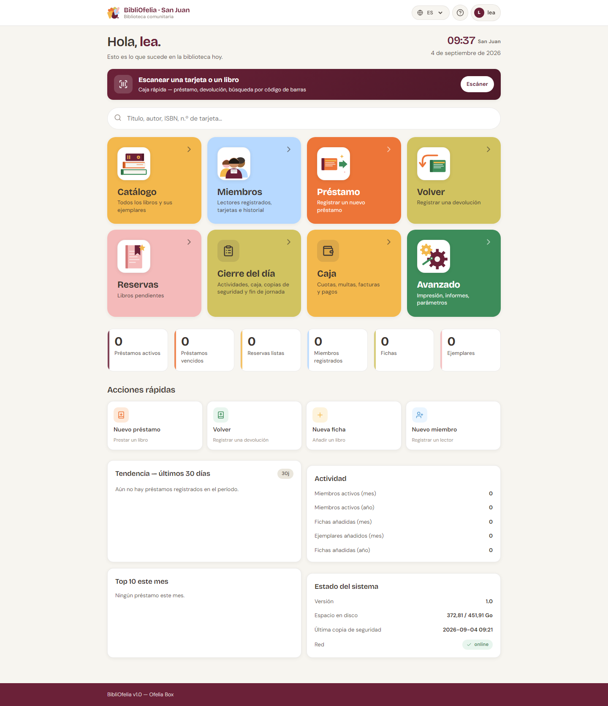

# Recorrido del panel

El panel es la página de inicio de BibliOfelia. Reúne todo lo que
necesita a diario.

## Las grandes tarjetas de arriba

Las tres tarjetas grandes coloreadas son las secciones principales:

- **Catálogo** (naranja) — todos los libros y sus ejemplares
- **Miembros** (azul) — los lectores inscritos, sus tarjetas, su
  historial
- **Avanzado** (verde) — impresión, informes, configuración

Las tarjetas **Préstamo** y **Devolución** también están accesibles
desde la barra de navegación en cada página: son las acciones más
frecuentes, siempre a un clic de distancia.

## Los contadores

Bajo las tarjetas, seis números resumen la actividad del momento:

- **Préstamos activos** — libros actualmente prestados
- **Préstamos vencidos** — préstamos cuya fecha de devolución ha
  pasado
- **Reservas listas** — libros reservados que ya han llegado
- **Miembros inscritos** — total de tarjetas activas
- **Registros** — fichas de libros en el catálogo
- **Ejemplares** — copias físicas en la biblioteca

## Acciones rápidas

Cuatro atajos para las acciones secundarias: **Inscripción** (nuevo
miembro), **Devolución**, **Nuevo registro** (añadir libro), **Nuevo
miembro**.

## Tendencia, actividad, estado del sistema

Más abajo, tres tarjetas informativas:

- **Tendencia — últimos 30 días**: curva de actividad
- **Actividad**: contadores de miembros activos, registros y
  ejemplares añadidos por mes y por año
- **Estado del sistema**: versión, espacio en disco, última copia
  de seguridad, red

## Seguimientos

Al final, la sección **Seguimientos** lista los préstamos más
atrasados con el nombre del miembro, el plazo vencido y el número de
días de atraso. Un clic en una línea abre la ficha del miembro.

!!! tip "Atajo escáner"
    El banner **Escanear una tarjeta o un libro** en medio del panel abre
    la [cámara de su dispositivo](scanner-camera.md) para leer directamente
    un código de barras y llegar a la página correcta sin navegar.
