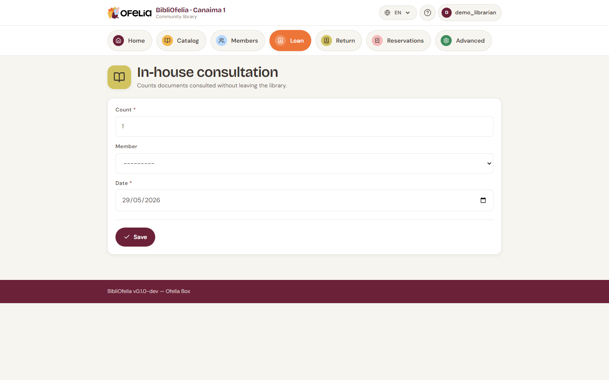

# In-library reading

When a book is read inside the library without being borrowed (a
comic flipped through by a child, a dictionary consulted for homework,
etc.), you can record it as an **in-library reading**.

It is optional, but useful for your statistics: without counting
readings, you underestimate the actual library attendance.

## Open the page

From the [**Lend**](/bibliofelia/en/loans/lend/){ target="_blank" } page, or
from **Advanced →
[In-library reading](/bibliofelia/en/loans/consultation/){ target="_blank" }**.

## Two entry modes

### Quick mode: a global counter

For the day, type the total number of readings observed (for example
12 children flipped through comics) and validate. No need to identify
books or members.

### Detailed mode: by book

Scan the book's barcode. The reading is recorded for that specific
book. You can optionally also scan the member's card if you want to
track who read what.

## When to use which?

- **Quick mode**: busy day, you don't want to interrupt your work to
  scan each book
- **Detailed mode**: you want to see which books are most read in
  the library (useful to adjust your acquisitions)

You can mix both: for example, quick mode for comics circulating a
lot, detailed mode for reference books.

## See the statistics

In-library readings appear in the [reports](../rapports/kpis.md)
alongside loans.
