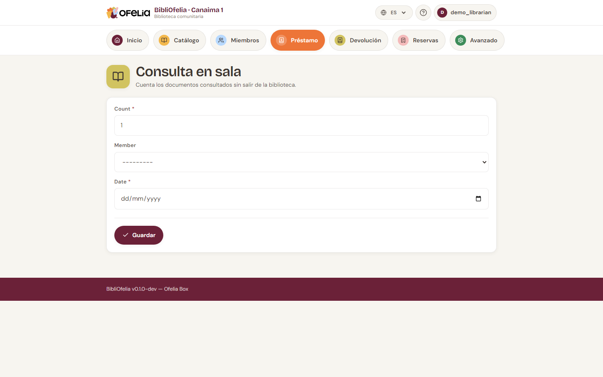

# Consulta in situ

Cuando un libro se lee en la biblioteca sin ser prestado (un cómic
hojeado por un niño el miércoles, un diccionario consultado para una
tarea, etc.), puede registrarlo como **consulta in situ**.

Es opcional, pero útil para sus estadísticas: sin contar las
consultas, subestima la asistencia real de su biblioteca.

## Abrir la página

Desde la página **Préstamo**, o desde **Avanzado → Consulta in
situ**.

## Dos modos de entrada

### Modo rápido: un contador global

Para el día, escriba el número total de consultas observadas (por
ejemplo 12 niños han hojeado cómics) y valide. Sin necesidad de
identificar los libros ni los miembros.

### Modo detallado: por libro

Escanee el código de barras del libro consultado. La consulta se
registra para ese libro preciso. Opcionalmente puede escanear
también la tarjeta del miembro si quiere rastrear quién ha leído
qué.

## ¿Cuándo usar uno u otro?

- **Modo rápido**: día cargado, no quiere interrumpir su trabajo
  para escanear cada libro
- **Modo detallado**: quiere ver qué libros se consultan más in situ
  (útil para ajustar sus adquisiciones)

Puede mezclar los dos: por ejemplo, modo rápido para los cómics que
circulan mucho, modo detallado para las obras de referencia.

## Ver las estadísticas

Las consultas aparecen en los [informes](../rapports/kpis.md) junto
con los préstamos.
