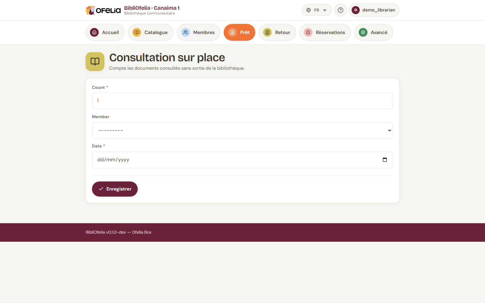

# Consultation sur place

Quand un livre est lu dans la bibliothèque sans être emprunté (BD
feuilletée par un enfant le mercredi, dictionnaire consulté pour un
devoir, etc.), vous pouvez l'enregistrer comme **consultation sur
place**.

C'est facultatif, mais utile pour vos statistiques : sans
consultations comptabilisées, vous sous-estimez la fréquentation
réelle de votre bibliothèque.

## Ouvrir la page Consultation

Depuis la page **Prêt**, ou depuis **Avancé → Consultation sur place**.

## Deux modes de saisie

### Mode rapide : un compteur global

Pour la journée, tapez le nombre total de consultations observées
(par exemple 12 enfants ont feuilleté des BD) et validez. Pas
besoin d'identifier les livres ni les membres.

### Mode détaillé : par livre

Scannez le code-barres du livre consulté. La consultation est
enregistrée pour ce livre précis. Vous pouvez optionnellement scanner
aussi la carte du membre si vous voulez tracer qui a lu quoi.

## Quand utiliser l'un ou l'autre ?

- **Mode rapide** : journée chargée, vous ne voulez pas interrompre
  votre travail pour scanner chaque livre
- **Mode détaillé** : vous voulez voir quels livres sont les plus
  consultés sur place (utile pour ajuster vos acquisitions)

Vous pouvez mélanger les deux : par exemple, mode rapide pour les BD
qui circulent beaucoup, mode détaillé pour les ouvrages de référence.

## Voir les statistiques

Les consultations apparaissent dans les [rapports](../rapports/kpis.md)
aux côtés des prêts.
