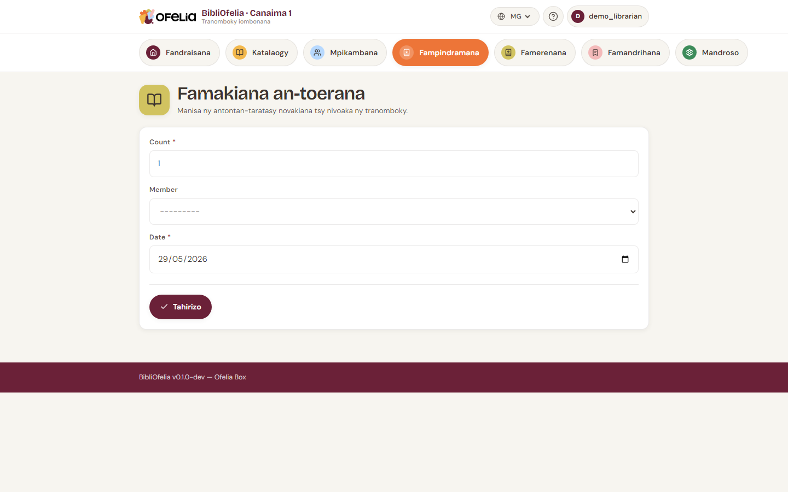

# Famakiana eo an-toerana

Rehefa misy boky vakiana ao amin'ny tranomboky fa tsy nampindramina
(BD novakian'ny ankizy ny alarobia, dictionnaire nanontaniana ho
an'ny devoir, sns.), azonao soratana ho **famakiana eo an-toerana**.

Tsy voatery izy, fa mahasoa ho an'ny statistikanao: raha tsy misy
famakiana voakajy, dia ambany kokoa ny tena fahatongavana ao amin'ny
tranombokinao.

## Sokafy ny pejy

Avy amin'ny pejy **Fampindramana**, na avy ao amin'ny **Mandroso →
Famakiana eo an-toerana**.

## Fomba fampidirana roa

### Fomba haingana: kaontera ankapobeny

Ho an'ny andro, soraty ny totalin'ny famakiana hita (ohatra ankizy
12 no nivahy BD) dia hamarino. Tsy mila mahafantatra boky na
mpianatra.

### Fomba antsipirihany: araka ny boky

Jereo ny code-barre an'ny boky novakiana. Ny famakiana dia voasoratra
ho an'io boky io. Azonao koa atao ny mijery ny karatry ny mpianatra
raha te hahafantatra hoe iza no namaky inona.

## Rahoviana no ampiasaina ny iray na ny iray?

- **Fomba haingana**: andro feno, tsy te-hanapaka ny asanao mba
  hijery boky tsirairay
- **Fomba antsipirihany**: te-hahita hoe iza no boky vakiana
  matetika eo an-toerana (mahasoa mba hanamboarana ny fividianana
  ho avy)

Azonao afangaro ny roa: ohatra, fomba haingana ho an'ny BD izay
mandeha matetika, fomba antsipirihany ho an'ny boky fanovozan-kevitra.

## Jereo ny statistika

Ny famakiana dia miseho ao amin'ny [tatitra](../rapports/kpis.md)
miaraka amin'ny fampindramana.
