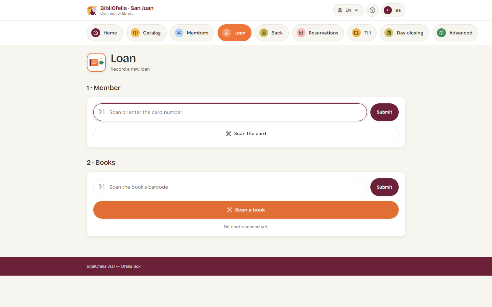

# Lending a book

Registering a loan is the most frequent action of the day. With a
barcode scanner or your device's camera, it takes less than 10 seconds.

The **Lend** page is organized in three steps that you follow in
order: first the member, then the book(s), and finally the
confirmation.

!!! tip "Before you start"
    To open this page quickly from anywhere in the site, click the
    orange [**Lend**](/bibliofelia/en/loans/lend/){ target="_blank" } tile in
    the top navigation bar.

## Step 1 — Identify the member

The member presents their card. You have two ways to find them:

- **With a scanner**: scan the card's barcode. The member is
  identified immediately, you move to step 2.
- **By keyboard**: type the card number (the digits at the bottom of
  the card) into field ➊, then press **Enter** or click **Validate**.

You can also click **➋ Scan the card** to open your device's **camera**
and read the card barcode — handy if the scanner is not plugged in (see
[Scanning with the camera](../premiers-pas/scanner-camera.md)).

!!! info "Member doesn't have their card?"
    No problem: use the global search at the top of the site (type
    the member's name) to open their profile, then click **New loan**
    from their profile.

Once the member is identified, BibliOfelia displays their name and
category. If alerts exist (expired card, too many active loans), they
appear in yellow just below the name — read them before proceeding.

## Step 2 — Scan the book

Enter the book(s) to lend the same way:

- **Scanner**: scan the book's barcode. The book is added to the
  basket and the field clears for the next one.
- **Keyboard**: type the Ofelia code (the digits under the barcode on
  the label) into field ➌, then **Enter** or **Validate**.
- **Camera**: click the orange **➍ Scan a book** button to open your
  device's camera.

You can chain several books for the same member — each scan adds a
line to the basket. To remove a book from the basket, click the cross
on the right of its line.

!!! warning "Common edge cases"
    - **Book already on loan**: a red message appears. Check it is
      not a duplicate scan before insisting.
    - **Member reached their limit**: the member's category sets a
      maximum number of simultaneous loans (default: 5 for an adult,
      3 for a child). Ask the member to return a book, or adjust the
      category from their profile.
    - **Card expired**: the loan is blocked until the card is
      renewed. See
      [Renewal and expiration](../usagers/renouvellement.md).

## Step 3 — Confirm

When all books are in the basket, the section **3 · Confirm** appears
at the bottom. You can add a free-form note (optional), then click the
big orange **Lend N books** button.

BibliOfelia records the loans, automatically calculates the return
date (21 days later by default) and returns to an empty form ready
for the next member.

## How much time is left?

The member profile permanently displays active loans with due dates.
When a loan approaches its limit or passes it, it appears in the
**Follow-ups** section of the [dashboard](../premiers-pas/dashboard.md).

## Going further

- [Register a return](retour.md) — when the member brings books back
- [Renew a loan](prolongation.md) — extend the return date
- [Scanning with the camera](../premiers-pas/scanner-camera.md) — how the
  site's camera works
