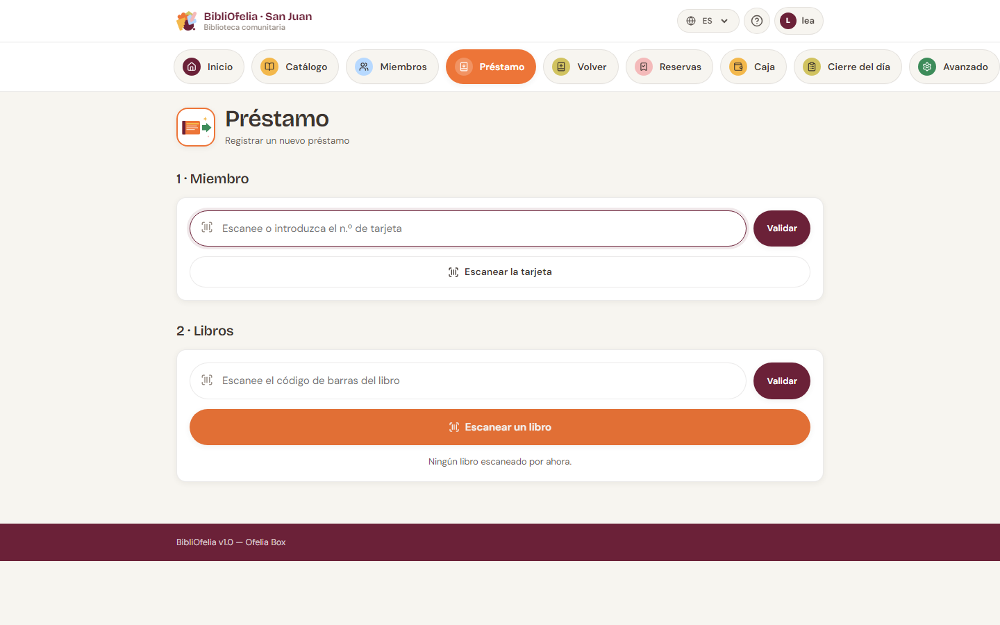

# Hacer un préstamo

Registrar un préstamo es la acción más frecuente del día. Con un
escáner o la cámara de su dispositivo, toma menos de 10 segundos.

La página **Préstamo** está organizada en tres pasos que sigue en
orden: primero el miembro, luego el o los libros, y finalmente la
confirmación.

!!! tip "Antes de empezar"
    Para abrir esta página rápidamente desde cualquier sitio del
    sitio, haga clic en la tarjeta naranja
    [**Préstamo**](/bibliofelia/es/loans/lend/){ target="_blank" } en la barra
    de navegación de arriba.

## Paso 1 — Identificar al miembro

El miembro se presenta con su tarjeta. Tiene dos formas de
encontrarlo:

- **Con un escáner**: escanee el código de barras de la tarjeta. El
  miembro se identifica inmediatamente, pasa al paso 2.
- **Por teclado**: escriba el número de tarjeta (los dígitos al pie
  de la tarjeta) en el campo ➊, luego pulse **Enter** o haga clic
  en **Validar**.

También puede hacer clic en **➋ Escanear la tarjeta** para abrir la
**cámara** de su dispositivo y leer el código de barras de la tarjeta —
práctico si el escáner no está conectado (véase [Escanear con la
cámara](../premiers-pas/scanner-camera.md)).

!!! info "¿El miembro no tiene su tarjeta?"
    Sin problema: use la búsqueda global arriba del sitio (escriba
    el nombre del miembro) para abrir su ficha, luego haga clic en
    **Nuevo préstamo** desde su ficha.

Una vez identificado el miembro, BibliOfelia muestra su nombre y
categoría. Si hay alertas (tarjeta expirada, demasiados préstamos
activos), aparecen en amarillo justo bajo el nombre — léalas antes
de continuar.

Una **tarjeta antigua** (tras un « Reemplazar la tarjeta ») sigue
reconocida: la pantalla lo señala, y es el momento de imprimir la
nueva. Véase [Tarjeta de miembro](../usagers/carte.md).

## Paso 2 — Escanear el libro

Introduzca el o los libros a prestar de la misma forma:

- **Escáner**: escanee el código de barras del libro. El libro se
  añade al carrito y el campo se vacía para el siguiente.
- **Teclado**: escriba el código Ofelia (los dígitos bajo el código
  de barras de la etiqueta) en el campo ➌, luego **Enter** o
  **Validar**.
- **Cámara**: haga clic en el botón naranja **➍ Escanear un libro**
  para abrir la cámara de su dispositivo.

Puede encadenar varios libros para un mismo miembro — cada escaneo
añade una línea al carrito. Cada línea muestra el **título**, el
**autor** y **los dos códigos** del ejemplar (Ofelia y, si hay, el
código externo). Para retirar un libro del carrito, haga clic en la
cruz a la derecha de su línea.

!!! warning "Casos particulares a conocer"
    - **El libro ya está prestado**: aparece un mensaje rojo.
      Verifique que no se trate de un escaneo duplicado antes de
      insistir.
    - **El miembro ha alcanzado su límite**: la categoría del
      usuario fija un máximo de préstamos simultáneos (por defecto,
      5 para un adulto, 3 para un niño). Pídale al miembro que
      devuelva un libro, o ajuste la categoría desde su ficha.
    - **La tarjeta está expirada**: el préstamo se bloquea mientras
      la tarjeta no se renueve. Vea
      [Renovación y expiración](../usagers/renouvellement.md).

## Paso 3 — Confirmar

Cuando todos los libros están en el carrito, la sección
**3 · Confirmar** aparece abajo. Puede añadir una nota libre
(opcional), luego haga clic en el gran botón naranja **Prestar N
libros**.

BibliOfelia registra los préstamos, calcula automáticamente la fecha
de devolución (por defecto 21 días después) y vuelve a un formulario
vacío listo para el siguiente miembro.

## ¿Cuánto tiempo queda?

La ficha del miembro muestra permanentemente sus préstamos activos
con la fecha de vencimiento. Cuando un préstamo se acerca a su fecha
límite o la supera, aparece en la sección **Seguimientos** del
[panel](../premiers-pas/dashboard.md).

## Para ir más lejos

- [Registrar una devolución](retour.md) — cuando el miembro trae
  sus libros
- [Renovar un préstamo](prolongation.md) — extender la fecha de
  devolución
- [Escanear con la cámara](../premiers-pas/scanner-camera.md) — cómo
  funciona la cámara del sitio
