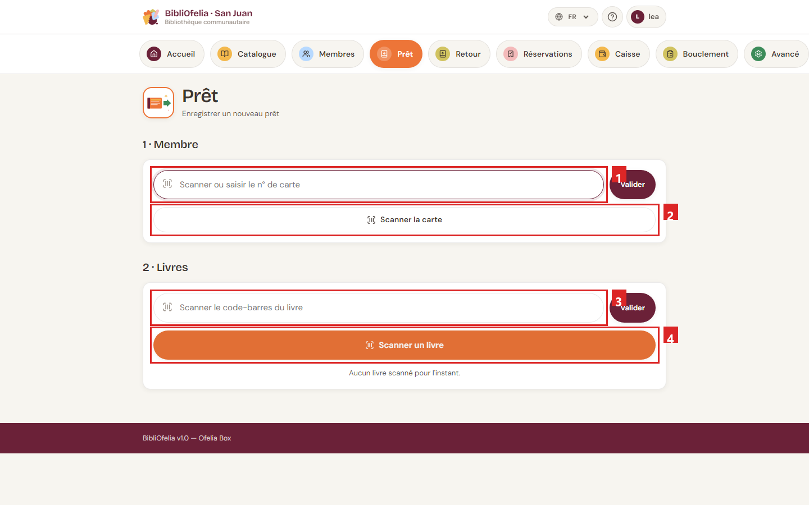

# Faire un prêt

Enregistrer un prêt est le geste le plus fréquent de la journée. Avec une
douchette ou la caméra de votre appareil, il prend moins de 10 secondes.

La page **Prêt** est organisée en trois étapes que vous suivez dans l'ordre :
d'abord le membre, ensuite le ou les livres, et enfin la confirmation.

!!! tip "Avant de commencer"
    Pour ouvrir cette page rapidement depuis n'importe où dans le site,
    cliquez sur la tuile orange
    [**Prêt**](/bibliofelia/fr/loans/lend/){ target="_blank" } dans la barre de
    navigation en haut.

## Étape 1 — Identifier le membre

Le membre se présente avec sa carte. Vous avez deux façons de le retrouver :

- **Avec une douchette** : scannez le code-barres de la carte. Le membre est
  identifié immédiatement, vous passez à l'étape 2.
- **Au clavier** : tapez le numéro de carte (les chiffres en bas de la
  carte) dans le champ ➊, puis appuyez sur **Entrée** ou cliquez sur
  **Valider**.

Vous pouvez aussi cliquer sur **➋ Scanner la carte** pour ouvrir la
**caméra** de votre appareil et lire le code-barres de la carte —
pratique si la douchette n'est pas branchée (voir [Scanner avec la
caméra](../premiers-pas/scanner-camera.md)).

!!! info "Le membre n'a pas sa carte ?"
    Pas de problème : utilisez la recherche globale en haut du site
    (tapez le nom du membre) pour ouvrir sa fiche, puis cliquez sur
    **Nouveau prêt** depuis sa fiche.

Une fois le membre identifié, BibliOfelia affiche son nom et sa catégorie.
Si des alertes existent (carte expirée, trop de prêts en cours), elles
apparaissent en jaune juste sous le nom — lisez-les avant de poursuivre.

Une **ancienne carte** (après un « Remplacer la carte ») est encore
reconnue : l'écran le signale, et c'est le moment d'imprimer la
nouvelle. Voir [Carte de membre](../usagers/carte.md).

## Étape 2 — Scanner le livre

Saisissez le ou les livres à prêter de la même façon :

- **Douchette** : scannez le code-barres du livre. Le livre s'ajoute au
  panier et le champ se vide pour le suivant.
- **Clavier** : tapez le code Ofelia (les chiffres sous le code-barres
  de l'étiquette) dans le champ ➌, puis **Entrée** ou **Valider**.
- **Caméra** : cliquez sur le bouton orange **➍ Scanner un livre** pour
  ouvrir la caméra de votre appareil.

Vous pouvez enchaîner plusieurs livres pour un même membre — chaque scan
ajoute une ligne au panier. Chaque ligne montre le **titre**, l'**auteur**
et **les deux codes** de l'exemplaire (Ofelia et, s'il y en a un, le
code externe). Pour retirer un livre du panier, cliquez sur la croix
à droite de sa ligne.

!!! warning "Cas particuliers à connaître"
    - **Le livre est déjà prêté** : un message rouge s'affiche.
      Vérifiez qu'il ne s'agit pas d'un doublon de scan avant d'insister.
    - **Le membre a atteint sa limite** : la catégorie de l'usager fixe
      un maximum de prêts simultanés (par défaut, 5 pour un adulte, 3
      pour un enfant). Demandez au membre de rendre un livre, ou
      ajustez la catégorie depuis sa fiche.
    - **La carte est expirée** : le prêt est bloqué tant que la carte
      n'est pas renouvelée. Voir
      [Renouvellement et expiration](../usagers/renouvellement.md).

## Étape 3 — Confirmer

Quand tous les livres sont dans le panier, la section **3 · Confirmer**
apparaît en bas. Vous pouvez ajouter une note libre (facultatif), puis
cliquez sur le grand bouton orange **Prêter N livres**.

BibliOfelia enregistre les prêts, calcule automatiquement la date de
retour (par défaut, 21 jours plus tard) et revient à un formulaire vide
prêt pour le membre suivant.

## Combien de temps reste-t-il ?

La fiche du membre affiche en permanence ses prêts en cours avec la
date d'échéance. Lorsqu'un prêt approche de sa date limite ou la
dépasse, il apparaît dans la section **Relances à faire** du
[tableau de bord](../premiers-pas/dashboard.md).

## Pour aller plus loin

- [Enregistrer un retour](retour.md) — quand le membre rapporte ses livres
- [Prolonger un prêt](prolongation.md) — étendre la date de retour
- [Scanner avec la caméra](../premiers-pas/scanner-camera.md) — comment la
  caméra du site fonctionne
