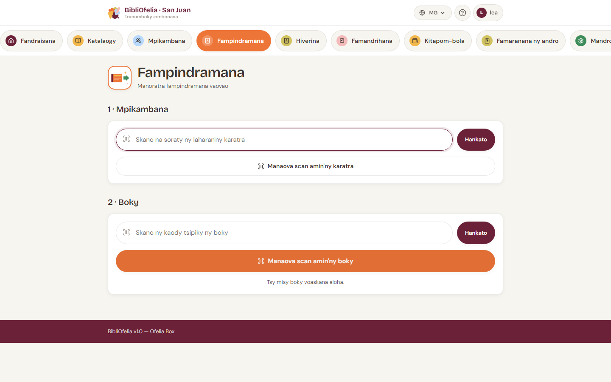

# Mampindrana boky

Ny fanoratana fampindramana no asa matetika indrindra amin'ny andro.
Miaraka amin'ny scanner na ny fakantsarin'ny fitaovanao, dia maharitra
latsaky ny 10 segondra izany.

Ny pejy **Fampindramana** dia voalamina amin'ny dingana telo izay
arahinao araka ny filaharana: aloha ny mpianatra, dia ny boky, ary
farany ny fanamarinana.

!!! tip "Alohan'ny hanombohana"
    Mba hanokafana haingana ity pejy ity avy amin'ny toerana rehetra
    ao amin'ny tranonkala, click amin'ny karatra volom-boasary
    [**Fampindramana**](/bibliofelia/mg/loans/lend/){ target="_blank" } eo
    amin'ny tsipika fitetezana.

## Dingana 1 — Mahafantatra ny mpianatra

Ny mpianatra dia miseho miaraka amin'ny karatrany. Manana fomba roa
ahitanao azy ianao:

- **Miaraka amin'ny scanner**: jereo ny code-barre an'ny karatra.
  Voafantatra avy hatrany ny mpianatra, mandeha amin'ny dingana 2
  ianao.
- **Amin'ny clavier**: soraty ny laharan-karatra (ny isa eo
  ambanin'ny karatra) ao amin'ny toerana ➊, dia tsindrio **Enter**
  na click amin'ny **Hanamarina**.

Azonao atao koa ny click amin'ny **➋ Hijery karatra** mba hanokatra ny
**fakantsarin'ny** fitaovanao sy hamaky ny code-barre an'ny karatra —
mahasoa raha tsy tafiditra ny scanner (jereo ny [Mi-scan amin'ny
fakantsary](../premiers-pas/scanner-camera.md)).

!!! info "Tsy manana ny karatrany ny mpianatra?"
    Tsy olana izany: ampiasao ny fikarohana ankapobeny ambonin'ny
    tranonkala (soraty ny anaran'ny mpianatra) mba hanokafana ny
    takelakany, dia click amin'ny **Fampindramana vaovao** avy amin'ny
    takelakany.

Rehefa voafantatra ny mpianatra, ny BibliOfelia dia mampiseho ny
anarany sy ny sokajiny. Raha misy fampitandremana (karatra tapitra,
fampindramana be loatra), miseho amin'ny vola eo ambanin'ny anarana
izany — vakio alohan'ny manohy.

Ny **karatra taloha** (aorian'ny « Hanolo ny karatra ») dia mbola
fantatra: ny pejy milaza izany, ary izao no fotoana hanontana ny
vaovao. Jereo [Karatra mpianatra](../usagers/carte.md).

## Dingana 2 — Hijery ny boky

Ampidiro ireo boky hampindramina amin'ny fomba mitovy:

- **Scanner**: jereo ny code-barre an'ny boky. Ny boky dia ampiana
  ao amin'ny panier ary mazava ny toerana ho an'ny manaraka.
- **Clavier**: soraty ny code Ofelia (ny isa eo ambanin'ny code-barre
  an'ny etikety) ao amin'ny toerana ➌, dia **Enter** na
  **Hanamarina**.
- **Fakantsary**: click amin'ny bokotra volom-boasary **➍ Hijery boky**
  mba hanokatra ny fakantsarin'ny fitaovanao.

Azonao atao ny mampifandimby boky maro ho an'ny mpianatra iray —
scan tsirairay no manampy filaharana iray ao amin'ny panier. Ny
filaharana tsirairay dia mampiseho ny **lohateny**, ny **mpanoratra**
sy **ny kaody roa** an'ny kopia (Ofelia sy, raha misy, ny code
externe). Mba hanesorana boky avy amin'ny panier, click amin'ny
tapa-davy eo ankavanan'ny filaharany.

!!! warning "Toe-javatra manokana"
    - **Efa nampindramin'ny olona ny boky**: hafatra mena no miseho.
      Hamarino aloha hoe tsy doublon scan io alohan'ny hanizingana.
    - **Efa tonga amin'ny fetra ny mpianatra**: ny sokajin'ny
      mpianatra dia mametra ny isan-kalehibe an'ny fampindramana
      miaraka (araka ny default, 5 ho an'ny olon-dehibe, 3 ho an'ny
      ankizy). Angataho amin'ny mpianatra mba hanome boky, na
      ovaina ny sokajy avy amin'ny takelakany.
    - **Tapitra ny karatra**: voasakana ny fampindramana raha tsy
      avaozina ny karatra. Jereo [Fanavaozana sy
      fahataperana](../usagers/renouvellement.md).

## Dingana 3 — Hanamarina

Rehefa ao amin'ny panier ny boky rehetra, ny fizarana **3 ·
Hanamarina** dia miseho ambany. Azonao ampiana note malalaka (tsy
voatery), dia click amin'ny bokotra volom-boasary lehibe **Hampindrana
N boky**.

Ny BibliOfelia dia manoratra ny fampindramana, mikajy automatika ny
daty famerenana (araka ny default 21 andro aoriana) ary miverina
amin'ny formulaire foana vonona ho an'ny mpianatra manaraka.

## Firy fotoana sisa?

Ny takelakan'ny mpianatra dia mampiseho mandrakariva ny fampindramana
mihazo miaraka amin'ny daty fahataperana. Rehefa manakaiky ny faharany
na mihoatra ilay fampindramana, miseho ao amin'ny fizarana **Tara
hatonina** an'ny [tabilao](../premiers-pas/dashboard.md).

## Mba handehana lavitra

- [Manoratra famerenana](retour.md) — rehefa mitondra boky ny
  mpianatra
- [Hanitatra fampindramana](prolongation.md) — manaitra ny daty
  famerenana
- [Mi-scan amin'ny fakantsary](../premiers-pas/scanner-camera.md) — ny
  fiasan'ny fakantsarin'ny tranonkala
